# 소셜 로그인 방식 비교: 웹(서버) vs 앱(네이티브)

## 개요

소셜 로그인은 OAuth 2.0 / OpenID Connect 프로토콜을 기반으로 하며, 구현 위치(서버 vs 앱)에 따라 플로우와 보안 모델이 달라집니다.

### OAuth 2.0 vs OpenID Connect

| 프로토콜 | 목적 | 반환 토큰 |
|----------|------|----------|
| **OAuth 2.0** | 권한 위임 (Authorization) | Access Token |
| **OpenID Connect** | 인증 (Authentication) | ID Token + Access Token |

> **OpenID Connect**는 OAuth 2.0 위에 구축된 인증 레이어로, 사용자 신원 확인을 위한 **ID Token (JWT)** 을 추가로 제공합니다.

---

## 1. 웹 소셜 로그인 (서버 처리 방식)

### 1.1 플로우 다이어그램

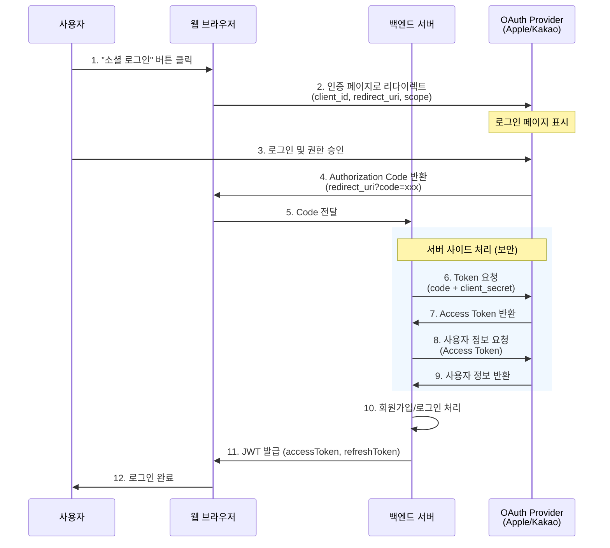

### 1.2 상세 단계 설명

| 단계 | 위치 | 설명 |
|------|------|------|
| 1-2 | 클라이언트 | 사용자가 로그인 버튼 클릭 → OAuth Provider 인증 페이지로 리다이렉트 |
| 3 | Provider | 사용자가 계정 로그인 및 앱 권한 승인 |
| 4-5 | 클라이언트 | Authorization Code를 redirect_uri로 받아 백엔드에 전달 |
| 6-7 | 서버 | `client_secret`을 사용해 Code → Access Token 교환 |
| 8-9 | 서버 | Access Token으로 Provider API 호출하여 사용자 정보 획득 |
| 10-12 | 서버 | 사용자 생성/조회 후 자체 JWT 발급 |

### 1.3 Authorization Code Flow 요청 예시

```typescript
// 1단계: 인증 페이지로 리다이렉트
const authUrl = new URL('https://kauth.kakao.com/oauth/authorize');
authUrl.searchParams.set('client_id', 'YOUR_CLIENT_ID');
authUrl.searchParams.set('redirect_uri', 'https://your-app.com/callback');
authUrl.searchParams.set('response_type', 'code');
authUrl.searchParams.set('scope', 'openid profile email');

window.location.href = authUrl.toString();
```

```typescript
// 6단계: 서버에서 Token 교환 (백엔드)
const tokenResponse = await fetch('https://kauth.kakao.com/oauth/token', {
  method: 'POST',
  headers: { 'Content-Type': 'application/x-www-form-urlencoded' },
  body: new URLSearchParams({
    grant_type: 'authorization_code',
    client_id: 'YOUR_CLIENT_ID',
    client_secret: 'YOUR_CLIENT_SECRET',  // 서버에서만 사용
    redirect_uri: 'https://your-app.com/callback',
    code: authorizationCode,
  }),
});

const { access_token, id_token } = await tokenResponse.json();
```

### 1.4 특징 요약

| 항목 | 설명 |
|------|------|
| **방식** | Authorization Code Flow |
| **토큰 교환 위치** | 백엔드 서버 (`client_secret` 보호) |
| **리다이렉트** | URL 기반 (callback URL) |
| **보안** | HTTPS + CORS + Same-Origin Policy |
| **사용자 정보 획득** | 서버가 Provider API 직접 호출 |

### 1.5 장단점

**장점:**
- `client_secret`이 서버에만 존재 (보안 우수)
- 기존 웹 인프라 활용 가능
- 서버에서 토큰 관리 일원화
- Refresh Token 갱신 처리 용이

**단점:**
- 브라우저 전환/팝업 필요
- 모바일 앱에서는 WebView 또는 브라우저 전환 필요
- UX가 네이티브 대비 떨어짐

---

## 2. 앱 소셜 로그인 (네이티브 처리 방식)

### 2.1 플로우 다이어그램

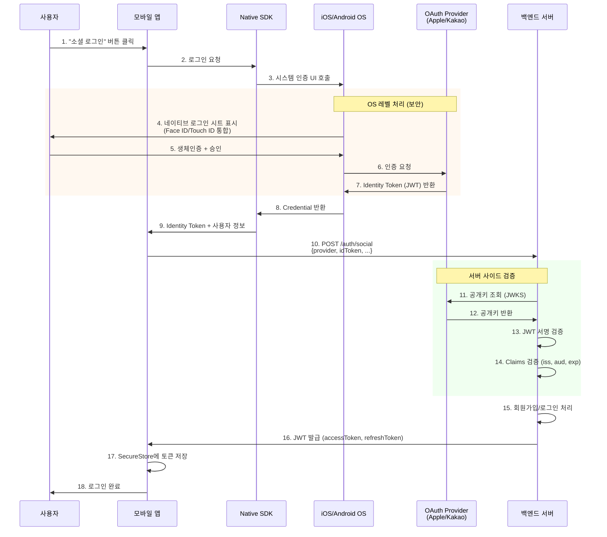

### 2.2 상세 단계 설명

| 단계 | 위치 | 설명 |
|------|------|------|
| 1-3 | 앱 | 사용자가 로그인 버튼 클릭 → SDK가 OS 레벨 인증 UI 호출 |
| 4-5 | OS | 네이티브 로그인 시트 표시 (Face ID/Touch ID 통합) |
| 6-7 | OS ↔ Provider | OS가 직접 Provider와 통신, Identity Token 획득 |
| 8-9 | 앱 | SDK를 통해 Identity Token과 사용자 정보 수신 |
| 10-14 | 서버 | Identity Token 서명 검증 (공개키 사용) |
| 15-18 | 서버 → 앱 | 사용자 처리 후 JWT 발급, 앱에서 SecureStore 저장 |

### 2.3 웹 방식과의 핵심 차이

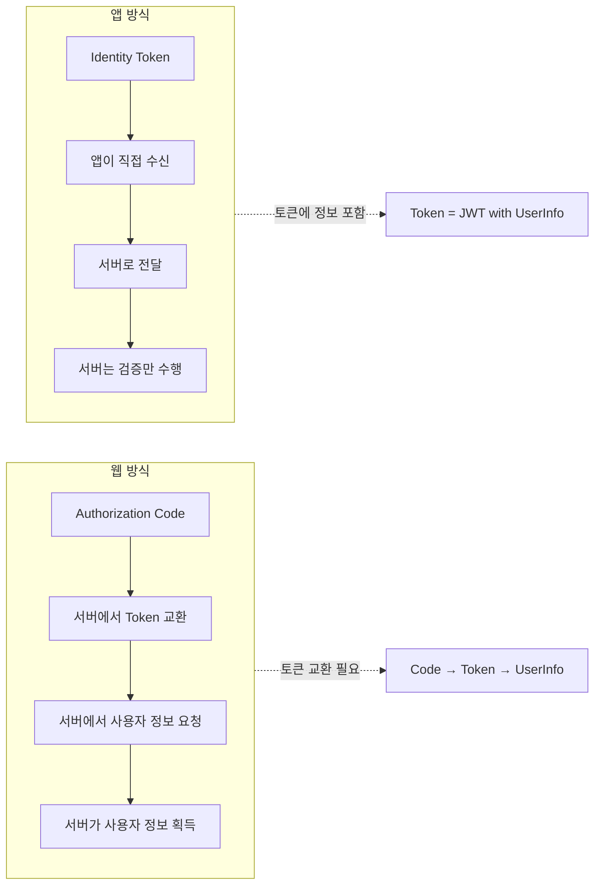

### 2.4 네이티브 SDK 사용 예시

#### Apple 로그인

```typescript
import * as AppleAuthentication from 'expo-apple-authentication';
import * as Crypto from 'expo-crypto';

// Nonce 생성 (보안 강화)
const rawNonce = Crypto.getRandomValues(new Uint8Array(32))
  .reduce((acc, x) => acc + x.toString(16).padStart(2, '0'), '');
const hashedNonce = await Crypto.digestStringAsync(
  Crypto.CryptoDigestAlgorithm.SHA256,
  rawNonce
);

// Apple 로그인 실행
const credential = await AppleAuthentication.signInAsync({
  requestedScopes: [
    AppleAuthentication.AppleAuthenticationScope.FULL_NAME,
    AppleAuthentication.AppleAuthenticationScope.EMAIL,
  ],
  nonce: hashedNonce,
});

// 결과
console.log({
  identityToken: credential.identityToken,  // JWT
  user: credential.user,                     // Apple User ID
  fullName: credential.fullName,             // 최초 로그인 시에만
  email: credential.email,                   // 최초 로그인 시에만
});
```

#### Kakao 로그인

```typescript
import { login, getProfile } from '@react-native-seoul/kakao-login';

// Kakao 로그인 실행
const token = await login();

// 결과
console.log({
  idToken: token.idToken,           // JWT (OpenID Connect 활성화 시)
  accessToken: token.accessToken,   // Access Token
  refreshToken: token.refreshToken,
});

// 프로필 조회 (필요 시)
const profile = await getProfile();
console.log({
  id: profile.id,
  nickname: profile.nickname,
  email: profile.email,
  profileImageUrl: profile.profileImageUrl,
});
```

### 2.5 특징 요약

| 항목 | 설명 |
|------|------|
| **방식** | Native SDK + OpenID Connect |
| **토큰** | Identity Token (JWT) 바로 반환 |
| **리다이렉트** | 없음 (앱 내에서 처리) |
| **보안** | Keychain + Secure Enclave + 생체인증 |
| **사용자 정보 획득** | 토큰 내에 포함 (서버는 검증만) |

### 2.6 장단점

**장점:**
- 네이티브 UX (앱 전환 없음)
- 생체인증 통합 (Face ID, Touch ID)
- 더 빠른 로그인 경험
- `client_secret` 불필요 (서명 검증 방식)
- OS 레벨 보안 (Keychain, Secure Enclave)

**단점:**
- 네이티브 빌드 필요 (Expo Go 불가)
- Provider별 SDK 설정 필요
- 플랫폼별 설정 복잡 (Apple Developer, Kakao Developers)

---

## 3. 핵심 차이점 비교

### 3.1 비교 다이어그램

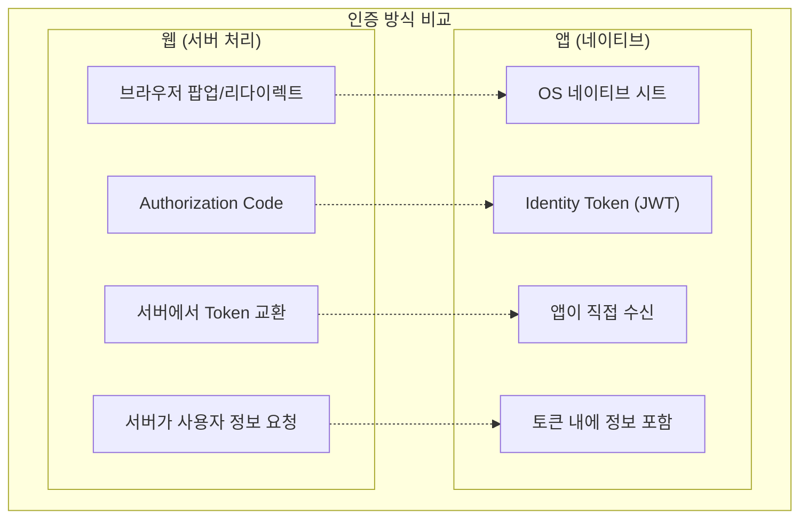

### 3.2 상세 비교표

| 구분 | 웹 (서버 처리) | 앱 (네이티브) |
|------|--------------|--------------|
| **인증 UI** | 브라우저 팝업/리다이렉트 | OS 네이티브 시트 |
| **토큰 획득** | Authorization Code → 서버에서 교환 | Identity Token 직접 반환 |
| **생체인증** | 불가 | Face ID / Touch ID 통합 |
| **UX** | 브라우저 전환 필요 | 앱 내에서 완료 |
| **보안 저장** | 쿠키/localStorage | Keychain/SecureStore |
| **Client Secret** | 서버에서 관리 필수 | 불필요 (서명 검증) |
| **사용자 정보** | 서버가 API로 요청 | 토큰 내에 포함 |
| **토큰 검증** | 서버가 직접 발급받음 | 서버가 서명 검증 |
| **Refresh Token** | 서버에서 관리 | 앱에서 관리 (SecureStore) |

---

## 4. Apple 로그인 vs Kakao 로그인 비교

### 4.1 공통점

두 Provider 모두 **OpenID Connect**를 지원하며, **ID Token (JWT)** 을 발급합니다.

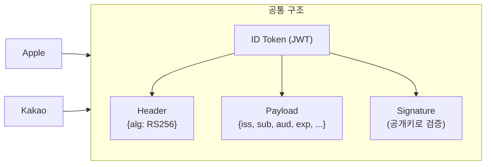

| 항목 | Apple | Kakao |
|------|-------|-------|
| **OpenID Connect** | 기본 지원 | 활성화 필요 (Kakao Developers 콘솔) |
| **ID Token 형식** | JWT | JWT |
| **서명 알고리즘** | RS256 | RS256 |
| **공개키 엔드포인트** | `https://appleid.apple.com/auth/keys` | `https://kauth.kakao.com/.well-known/jwks.json` |

### 4.2 Apple 로그인 상세

#### Identity Token 구조

```json
{
  "iss": "https://appleid.apple.com",
  "sub": "001234.abcd1234efgh5678ijkl9012mnop3456.0123",
  "aud": "com.growit.mobile",
  "iat": 1234567800,
  "exp": 1234567890,
  "nonce": "abc123",
  "nonce_supported": true,
  "email": "user@example.com",
  "email_verified": true,
  "is_private_email": false,
  "real_user_status": 2,
  "transfer_sub": "..."
}
```

#### 주요 특징

| 항목 | 설명 |
|------|------|
| **sub** | Apple User ID (고유, 불변, 앱별로 다름) |
| **email** | 최초 로그인 시에만 제공, 이후 null |
| **is_private_email** | "Hide My Email" 사용 여부 |
| **real_user_status** | 0: 미지원, 1: 알 수 없음, 2: 실제 사용자 |
| **transfer_sub** | 앱 이전 시 사용자 매핑용 |

#### 주의사항

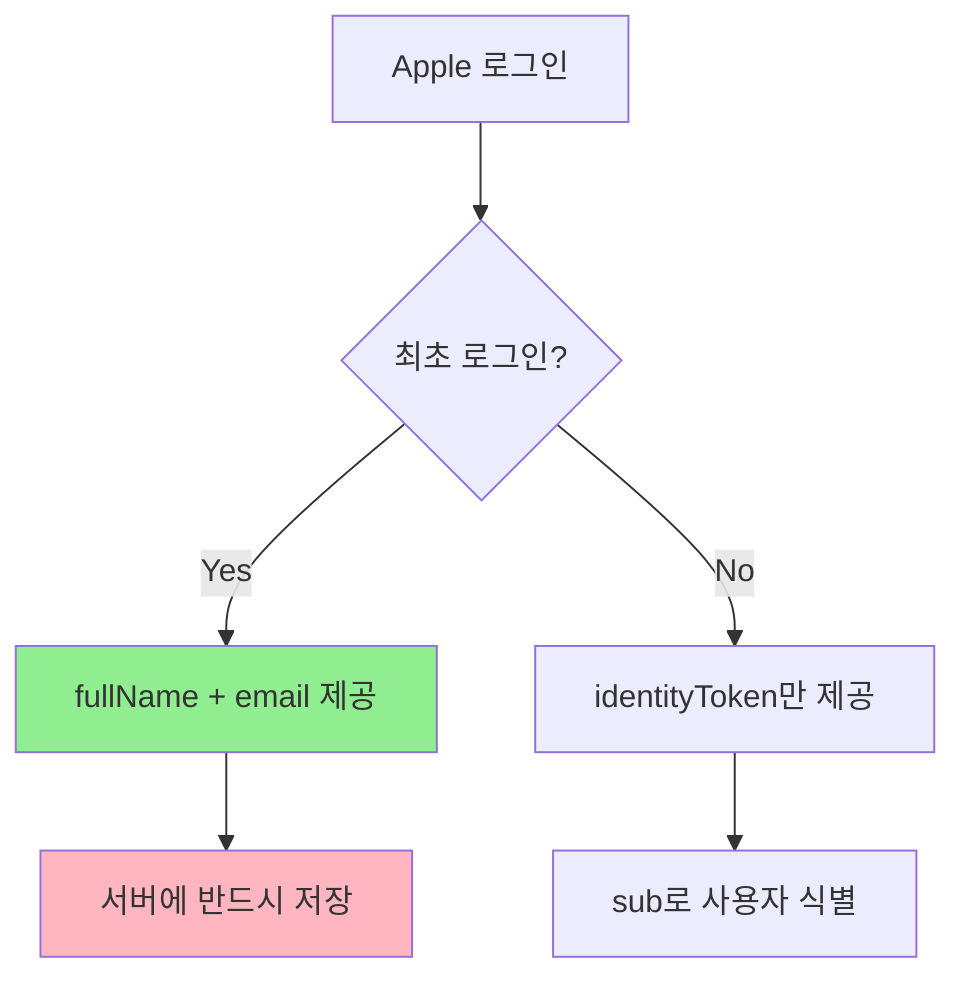

> **중요**: Apple은 최초 로그인 시에만 이름과 이메일을 제공합니다. 첫 로그인 시 반드시 서버에 저장해야 합니다.

### 4.3 Kakao 로그인 상세

#### OpenID Connect 활성화 방법

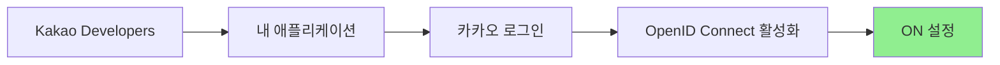

#### Identity Token 구조

```json
{
  "iss": "https://kauth.kakao.com",
  "sub": "1234567890",
  "aud": "YOUR_APP_KEY",
  "iat": 1234567800,
  "exp": 1234567890,
  "auth_time": 1234567800,
  "nonce": "abc123",
  "nickname": "홍길동",
  "picture": "https://k.kakaocdn.net/...",
  "email": "user@example.com",
  "email_verified": true
}
```

#### 주요 특징

| 항목 | 설명 |
|------|------|
| **sub** | Kakao User ID (고유, 숫자형 문자열) |
| **nickname** | 카카오 닉네임 (동의 시 매번 제공) |
| **picture** | 프로필 이미지 URL (동의 시) |
| **email** | 이메일 (동의 시 매번 제공) |
| **email_verified** | 이메일 인증 여부 |

### 4.4 상세 비교

| 항목 | Apple | Kakao |
|------|-------|-------|
| **사용자 식별자** | `sub` (고유, 불변, 앱별 다름) | `sub` (고유, 전역 동일) |
| **이름 제공** | 최초 1회만 | 매번 제공 가능 (동의 시) |
| **이메일 제공** | 최초 1회만 (숨김 옵션 있음) | 매번 제공 가능 (동의 시) |
| **프로필 이미지** | 제공 안 함 | 제공 (동의 시) |
| **OpenID Connect** | 기본 활성화 | 수동 활성화 필요 |
| **네이티브 SDK** | `expo-apple-authentication` | `@react-native-seoul/kakao-login` |
| **iOS 필수 여부** | iOS 앱에서 소셜 로그인 제공 시 **필수** | 선택 |
| **nonce 지원** | 지원 | 지원 |
| **실제 사용자 검증** | `real_user_status` 제공 | 미제공 |

---

## 5. 통합 서버 API 설계

### 5.1 통합 플로우

두 Provider 모두 ID Token을 제공하므로, 서버 API를 통일할 수 있습니다.

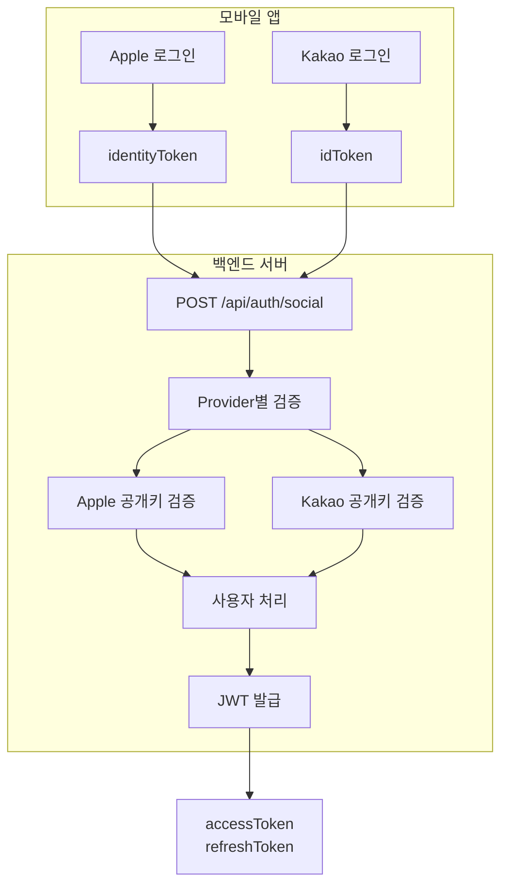

### 5.2 API 명세

#### 요청 형식

```typescript
// POST /api/auth/social
interface SocialLoginRequest {
  /** OAuth Provider */
  provider: 'apple' | 'kakao';

  /** Provider에서 받은 ID Token (JWT) */
  idToken: string;

  /** Nonce (Replay Attack 방지) */
  nonce?: string;

  /** 최초 로그인 시 사용자 정보 (Apple만 해당) */
  fullName?: {
    givenName: string;
    familyName: string;
  };

  /** 최초 로그인 시 이메일 (Apple만 해당) */
  email?: string;
}
```

#### 응답 형식

```typescript
interface SocialLoginResponse {
  /** 액세스 토큰 (API 요청 시 사용) */
  accessToken: string;

  /** 리프레시 토큰 (토큰 갱신 시 사용) */
  refreshToken: string;

  /** 사용자 정보 */
  user: {
    id: string;
    email: string;
    name: string;
    profileImage?: string;
  };

  /** 신규 가입 여부 */
  isNewUser: boolean;
}
```

### 5.3 서버 처리 로직

```typescript
import { verify } from 'jsonwebtoken';
import jwksClient from 'jwks-rsa';

// Provider별 JWKS 클라이언트
const jwksClients = {
  apple: jwksClient({
    jwksUri: 'https://appleid.apple.com/auth/keys',
    cache: true,
    rateLimit: true,
  }),
  kakao: jwksClient({
    jwksUri: 'https://kauth.kakao.com/.well-known/jwks.json',
    cache: true,
    rateLimit: true,
  }),
};

// Provider별 설정
const providerConfig = {
  apple: {
    issuer: 'https://appleid.apple.com',
    audience: 'com.growit.mobile',  // Bundle ID
  },
  kakao: {
    issuer: 'https://kauth.kakao.com',
    audience: 'YOUR_KAKAO_APP_KEY',
  },
};

async function handleSocialLogin(request: SocialLoginRequest) {
  const { provider, idToken, nonce, fullName, email } = request;
  const config = providerConfig[provider];

  // 1. JWT 헤더에서 kid 추출
  const decodedHeader = decodeJwtHeader(idToken);

  // 2. JWKS에서 공개키 조회
  const key = await jwksClients[provider].getSigningKey(decodedHeader.kid);
  const publicKey = key.getPublicKey();

  // 3. JWT 검증
  const decoded = verify(idToken, publicKey, {
    issuer: config.issuer,
    audience: config.audience,
    algorithms: ['RS256'],
  });

  // 4. Nonce 검증 (선택)
  if (nonce && decoded.nonce !== sha256(nonce)) {
    throw new Error('Nonce mismatch');
  }

  // 5. 사용자 조회 또는 생성
  let user = await findUserByProviderId(provider, decoded.sub);
  let isNewUser = false;

  if (!user) {
    isNewUser = true;
    user = await createUser({
      providerId: decoded.sub,
      provider,
      email: email || decoded.email,
      name: fullName
        ? `${fullName.familyName}${fullName.givenName}`
        : decoded.nickname || 'Unknown',
      profileImage: decoded.picture,
    });
  }

  // 6. JWT 발급
  const accessToken = generateAccessToken(user);
  const refreshToken = generateRefreshToken(user);

  return {
    accessToken,
    refreshToken,
    user: {
      id: user.id,
      email: user.email,
      name: user.name,
      profileImage: user.profileImage,
    },
    isNewUser,
  };
}
```

---

## 6. 보안 고려사항

### 6.1 ID Token 검증 체크리스트

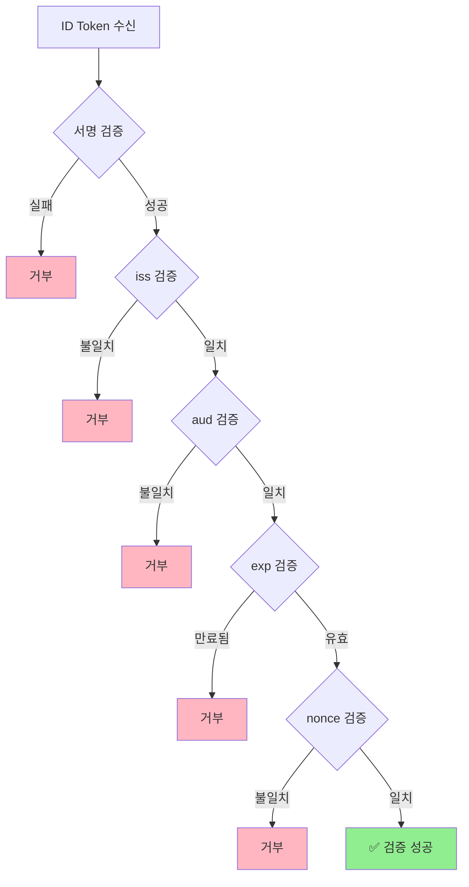

### 6.2 검증 항목 상세

| 항목 | 설명 | Apple 예시 | Kakao 예시 |
|------|------|-----------|-----------|
| **서명 (sig)** | Provider 공개키로 검증 | JWKS 사용 | JWKS 사용 |
| **발급자 (iss)** | 예상 발급자와 일치 | `https://appleid.apple.com` | `https://kauth.kakao.com` |
| **대상 (aud)** | 우리 앱 ID와 일치 | Bundle ID | App Key |
| **만료 (exp)** | 현재 시간보다 이후 | Unix timestamp | Unix timestamp |
| **발급시간 (iat)** | 너무 오래되지 않음 | 5분 이내 권장 | 5분 이내 권장 |
| **Nonce** | 요청 시 생성한 값과 일치 | SHA256 해시 비교 | SHA256 해시 비교 |

### 6.3 Nonce를 이용한 Replay Attack 방지

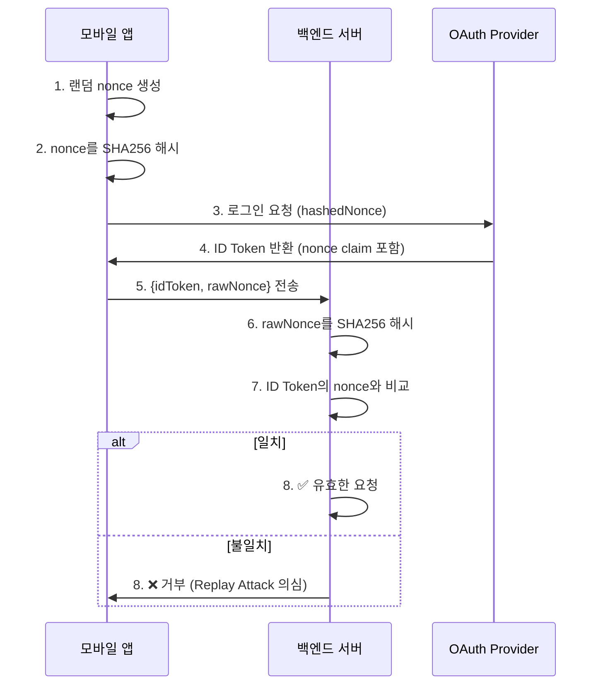

```typescript
// 앱에서
import * as Crypto from 'expo-crypto';

// 1. 랜덤 nonce 생성
const rawNonce = generateRandomString(32);

// 2. SHA256 해시
const hashedNonce = await Crypto.digestStringAsync(
  Crypto.CryptoDigestAlgorithm.SHA256,
  rawNonce
);

// 3. 로그인 요청
const credential = await AppleAuthentication.signInAsync({
  requestedScopes: [...],
  nonce: hashedNonce,
});

// 5. 서버로 전송
await fetch('/api/auth/social', {
  method: 'POST',
  body: JSON.stringify({
    provider: 'apple',
    idToken: credential.identityToken,
    nonce: rawNonce,  // 원본 nonce 전송
  }),
});
```

### 6.4 토큰 저장 보안

| 저장소 | 플랫폼 | 보안 수준 | 사용 예 |
|--------|--------|----------|---------|
| **Keychain** | iOS | 최상 (Secure Enclave) | 민감 토큰 |
| **Keystore** | Android | 높음 (TEE) | 민감 토큰 |
| **SecureStore** | Expo | 높음 (Keychain/Keystore 래퍼) | 민감 토큰 |
| **AsyncStorage** | React Native | 낮음 (평문) | 비민감 데이터만 |

```typescript
import * as SecureStore from 'expo-secure-store';

// 토큰 저장
await SecureStore.setItemAsync('accessToken', token.accessToken);
await SecureStore.setItemAsync('refreshToken', token.refreshToken);

// 토큰 조회
const accessToken = await SecureStore.getItemAsync('accessToken');

// 토큰 삭제 (로그아웃)
await SecureStore.deleteItemAsync('accessToken');
await SecureStore.deleteItemAsync('refreshToken');
```

---

## 7. 결론

### 7.1 하이브리드 앱 아키텍처

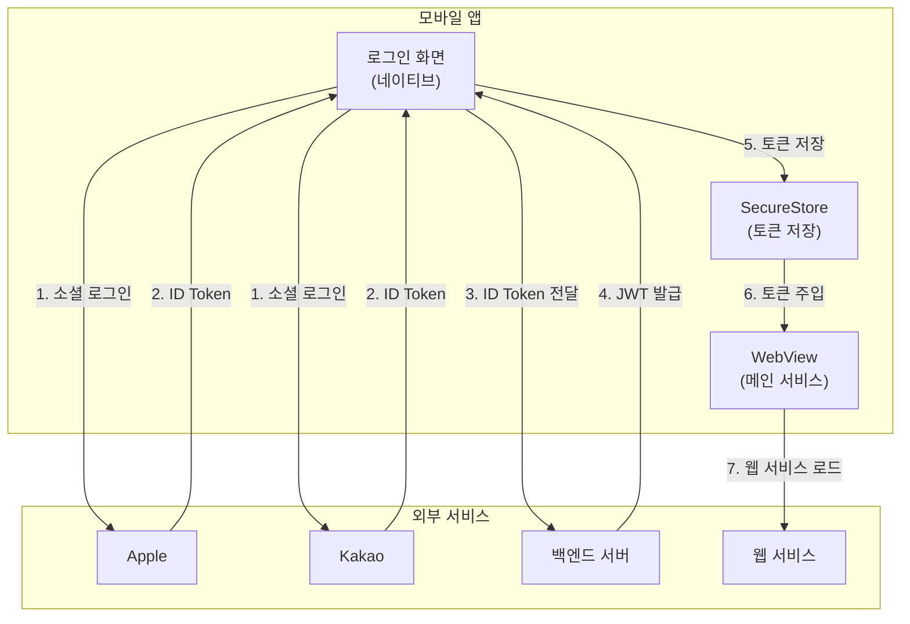

### 7.2 권장 구성

| 구성 요소 | 권장 방식 | 이유 |
|----------|----------|------|
| **로그인** | 앱 네이티브 (Apple, Kakao SDK) | Apple 정책 준수, 네이티브 UX |
| **토큰 저장** | SecureStore (앱) | Keychain/Keystore 보안 |
| **메인 서비스** | WebView | 웹 서비스 재활용 |
| **토큰 전달** | postMessage 또는 Cookie 주입 | 안전한 토큰 전달 |

### 7.3 선택 이유

1. **Apple 정책 준수**: iOS 앱에서 소셜 로그인 제공 시 Apple 로그인 필수
2. **네이티브 UX**: 생체인증 통합, 앱 내에서 완료
3. **보안**: SecureStore + Keychain/Keystore 활용
4. **통합 가능**: Apple/Kakao 모두 ID Token 방식으로 통일 가능
5. **서버 단순화**: 서버는 토큰 검증만 수행, `client_secret` 불필요

---

## 참고 자료

- [Apple Sign In - Apple Developer](https://developer.apple.com/sign-in-with-apple/)
- [Apple Sign In REST API](https://developer.apple.com/documentation/sign_in_with_apple/sign_in_with_apple_rest_api)
- [Kakao Login - Kakao Developers](https://developers.kakao.com/docs/latest/ko/kakaologin/common)
- [Kakao OpenID Connect](https://developers.kakao.com/docs/latest/ko/kakaologin/common#oidc)
- [OpenID Connect 스펙](https://openid.net/connect/)
- [OAuth 2.0 - RFC 6749](https://datatracker.ietf.org/doc/html/rfc6749)
- [expo-apple-authentication](https://docs.expo.dev/versions/latest/sdk/apple-authentication/)
- [expo-secure-store](https://docs.expo.dev/versions/latest/sdk/securestore/)
- [@react-native-seoul/kakao-login](https://github.com/crossplatformkorea/react-native-kakao-login)
