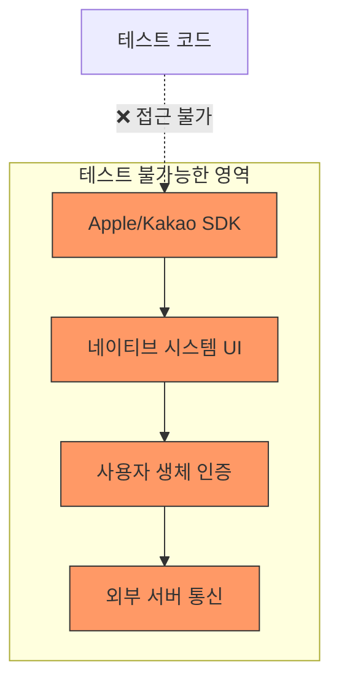
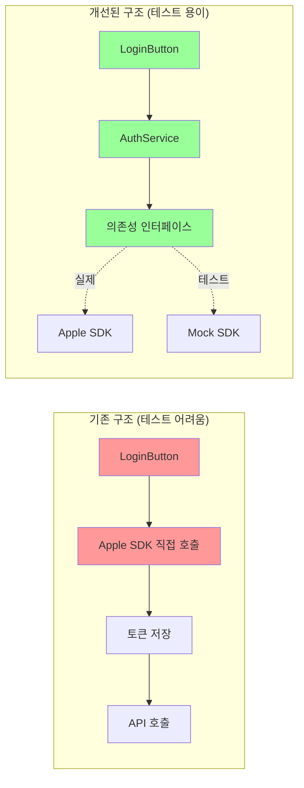
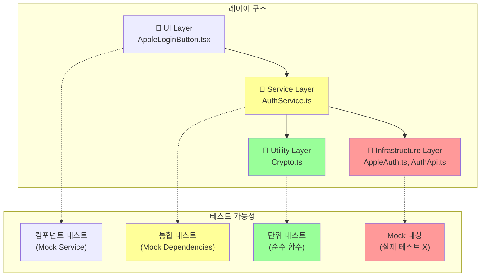
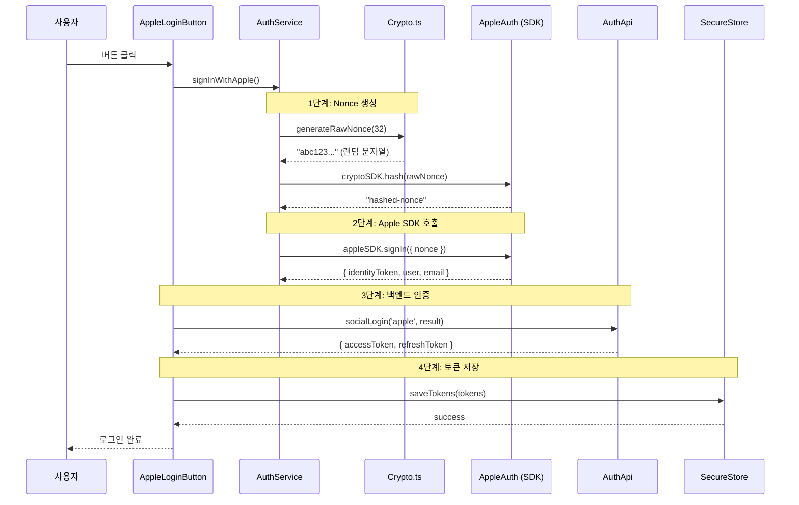
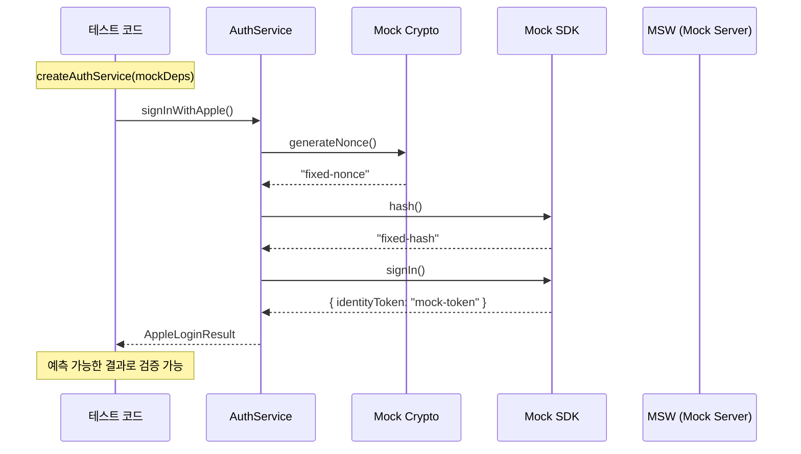
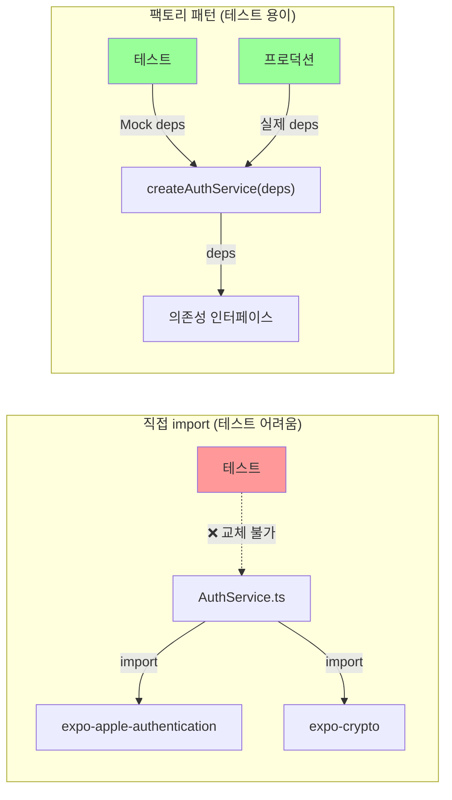
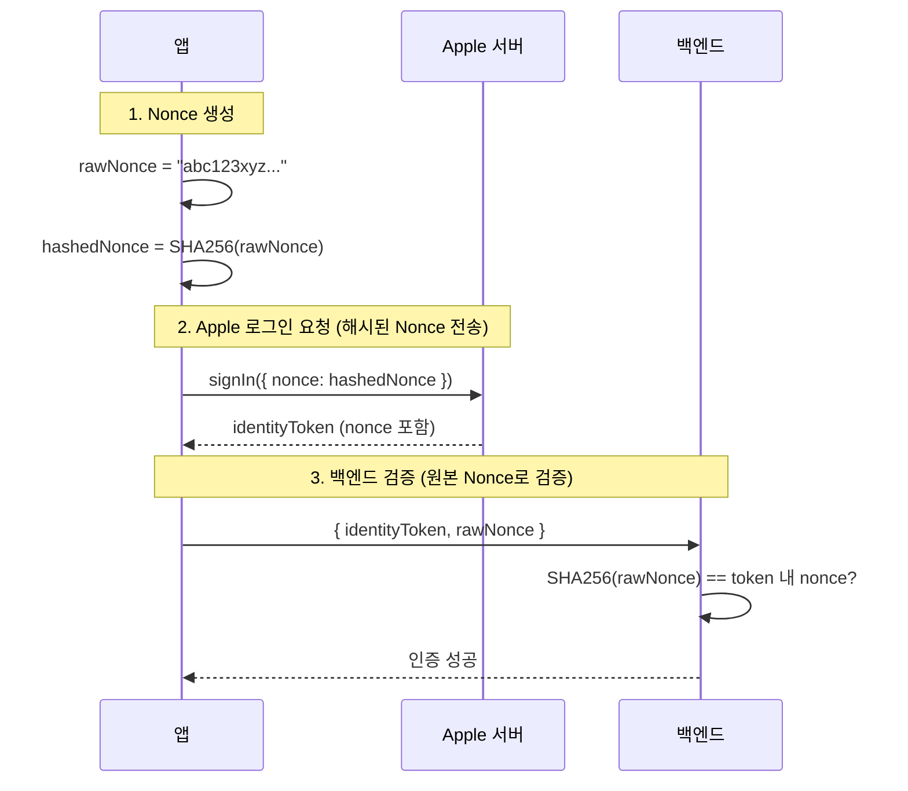
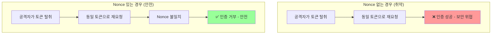
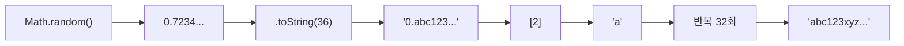

# 소셜 로그인 테스트 전략

## 개요

Apple/Kakao 소셜 로그인 코드의 테스트 전략과 테스트 가능한 코드 구조를 정리합니다.

## 왜 테스트 가능한 구조가 필요한가?

### 소셜 로그인의 테스트 어려움

소셜 로그인은 다음과 같은 이유로 테스트하기 어렵습니다:



**문제점:**
1. **네이티브 SDK 의존성**: `expo-apple-authentication`은 실제 iOS 기기에서만 동작
2. **시스템 UI**: Apple/Kakao 로그인 UI는 OS에서 제공하므로 자동화 불가
3. **외부 서비스**: Apple/Kakao 서버 상태에 따라 테스트 결과가 달라짐
4. **보안 요소**: Face ID, Touch ID 등 생체 인증은 시뮬레이션 불가

### 해결 방법: 의존성 분리



## 테스트 난이도 분류

| 구분 | 테스트 난이도 | 이유 |
|------|-------------|------|
| Apple/Kakao SDK 호출 | 어려움 | 네이티브 모듈, 실제 기기 필요 |
| Nonce 생성 로직 | 쉬움 | 순수 함수 |
| API 호출 | 중간 | Mock 필요 |
| 토큰 저장/조회 | 중간 | SecureStore Mock 필요 |

## 테스트 가능한 코드 구조

### 핵심 원칙: 의존성 분리

```
lib/auth/
├── AppleAuth.ts          # SDK 호출 (얇은 래퍼)
├── AuthService.ts        # 비즈니스 로직 (테스트 대상)
├── Crypto.ts             # 순수 함수 (테스트 용이)
├── AuthApi.ts            # API 호출
├── Types.ts              # 타입 정의
└── index.ts
```

### 각 파일의 역할과 분리 이유



| 파일 | 역할 | 분리 이유 |
|------|------|----------|
| `Crypto.ts` | Nonce 생성 | 외부 의존성 없는 순수 함수 → 100% 테스트 가능 |
| `AppleAuth.ts` | SDK 호출 래퍼 | 실제 SDK를 얇게 감싸서 Mock 교체 용이 |
| `AuthService.ts` | 비즈니스 로직 | 의존성 주입으로 모든 외부 요소 Mock 가능 |
| `AuthApi.ts` | API 통신 | MSW로 서버 응답 시뮬레이션 가능 |
| `Types.ts` | 타입 정의 | 인터페이스 기반 Mock 생성 가능 |

### Apple 로그인 실행 흐름

다음은 Apple 로그인의 전체 실행 흐름입니다:



### 테스트 시 Mock 적용 지점



## 코드 구조 상세 설명

### 1. 순수 함수 분리

테스트하기 쉬운 순수 함수를 별도 파일로 분리합니다.

```typescript
// src/lib/auth/Crypto.ts

// 순수 함수 - 테스트 용이
export const generateRawNonce = (length: number = 32): string => {
  return Array.from(
    { length },
    () => Math.random().toString(36)[2]
  ).join('');
};

// 의존성 주입 가능한 해시 함수
export const hashString = async (
  input: string,
  digestFn: (algorithm: string, data: string) => Promise<string>
): Promise<string> => {
  return digestFn('SHA-256', input);
};
```

### 2. SDK 래퍼 (얇은 레이어)

SDK 호출만 담당하는 얇은 래퍼를 만듭니다.

```typescript
// src/lib/auth/AppleAuth.ts

import * as AppleAuthentication from 'expo-apple-authentication';
import * as Crypto from 'expo-crypto';

// SDK 호출만 담당 (로직 없음)
export const appleSDK = {
  isAvailable: () => AppleAuthentication.isAvailableAsync(),

  signIn: (options: AppleAuthentication.AppleAuthenticationSignInOptions) =>
    AppleAuthentication.signInAsync(options),
};

export const cryptoSDK = {
  hash: (input: string) =>
    Crypto.digestStringAsync(Crypto.CryptoDigestAlgorithm.SHA256, input),
};
```

### 3. 비즈니스 로직 (의존성 주입)

팩토리 패턴으로 의존성을 주입받아 테스트 시 Mock으로 교체할 수 있게 합니다.

#### 왜 팩토리 패턴인가?



**팩토리 패턴의 장점:**
1. **테스트 시**: Mock 의존성을 주입하여 SDK 없이 테스트
2. **프로덕션 시**: 실제 의존성을 주입하여 정상 동작
3. **유연성**: 나중에 다른 SDK로 교체하기 쉬움

```typescript
// src/lib/auth/AuthService.ts

import { generateRawNonce } from './Crypto';
import { appleSDK, cryptoSDK } from './AppleAuth';
import type { AppleLoginResult, AuthDependencies } from './Types';

// 기본 의존성
const defaultDeps: AuthDependencies = {
  appleSDK,
  cryptoSDK,
  generateNonce: generateRawNonce,
};

// 의존성 주입으로 테스트 용이
export const createAuthService = (deps: AuthDependencies = defaultDeps) => {

  const signInWithApple = async (): Promise<AppleLoginResult> => {
    // 1. Nonce 생성 (주입된 함수 사용)
    const rawNonce = deps.generateNonce(32);
    const hashedNonce = await deps.cryptoSDK.hash(rawNonce);

    // 2. Apple 로그인 (주입된 SDK 사용)
    const credential = await deps.appleSDK.signIn({
      requestedScopes: [0, 1], // FULL_NAME, EMAIL
      nonce: hashedNonce,
    });

    if (!credential.identityToken) {
      throw new Error('Apple 로그인 실패: Identity Token이 없습니다.');
    }

    return {
      identityToken: credential.identityToken,
      user: credential.user,
      email: credential.email,
      fullName: credential.fullName,
      nonce: rawNonce,
    };
  };

  const isAppleAvailable = () => deps.appleSDK.isAvailable();

  return {
    signInWithApple,
    isAppleAvailable,
  };
};

// 기본 인스턴스 export
export const authService = createAuthService();
```

### 4. 타입 정의

```typescript
// src/lib/auth/Types.ts

export interface AppleLoginResult {
  identityToken: string;
  user: string;
  email: string | null;
  fullName: {
    givenName: string | null;
    familyName: string | null;
  } | null;
  nonce: string;
}

export interface AuthDependencies {
  appleSDK: {
    isAvailable: () => Promise<boolean>;
    signIn: (options: any) => Promise<any>;
  };
  cryptoSDK: {
    hash: (input: string) => Promise<string>;
  };
  generateNonce: (length: number) => string;
}
```

## 테스트 유형별 구현

### 1. 단위 테스트 (순수 함수)

```typescript
// src/lib/auth/__tests__/Crypto.test.ts

import { generateRawNonce } from '../Crypto';

describe('generateRawNonce', () => {
  it('지정된 길이의 nonce를 생성한다', () => {
    const nonce = generateRawNonce(32);
    expect(nonce).toHaveLength(32);
  });

  it('매번 다른 값을 생성한다', () => {
    const nonce1 = generateRawNonce();
    const nonce2 = generateRawNonce();
    expect(nonce1).not.toBe(nonce2);
  });

  it('영숫자만 포함한다', () => {
    const nonce = generateRawNonce(100);
    expect(nonce).toMatch(/^[a-z0-9]+$/);
  });
});
```

### 2. 통합 테스트 (의존성 주입)

```typescript
// src/lib/auth/__tests__/AuthService.test.ts

import { createAuthService } from '../AuthService';

describe('AuthService', () => {
  // Mock 의존성
  const mockDeps = {
    appleSDK: {
      isAvailable: jest.fn(),
      signIn: jest.fn(),
    },
    cryptoSDK: {
      hash: jest.fn(),
    },
    generateNonce: jest.fn(),
  };

  beforeEach(() => {
    jest.clearAllMocks();
  });

  describe('signInWithApple', () => {
    it('정상적으로 로그인하면 결과를 반환한다', async () => {
      // Arrange
      mockDeps.generateNonce.mockReturnValue('raw-nonce-123');
      mockDeps.cryptoSDK.hash.mockResolvedValue('hashed-nonce');
      mockDeps.appleSDK.signIn.mockResolvedValue({
        identityToken: 'token-abc',
        user: 'user-123',
        email: 'test@test.com',
        fullName: { givenName: '길동', familyName: '홍' },
      });

      const service = createAuthService(mockDeps);

      // Act
      const result = await service.signInWithApple();

      // Assert
      expect(result).toEqual({
        identityToken: 'token-abc',
        user: 'user-123',
        email: 'test@test.com',
        fullName: { givenName: '길동', familyName: '홍' },
        nonce: 'raw-nonce-123',
      });

      expect(mockDeps.appleSDK.signIn).toHaveBeenCalledWith({
        requestedScopes: [0, 1],
        nonce: 'hashed-nonce',
      });
    });

    it('identityToken이 없으면 에러를 던진다', async () => {
      mockDeps.generateNonce.mockReturnValue('nonce');
      mockDeps.cryptoSDK.hash.mockResolvedValue('hash');
      mockDeps.appleSDK.signIn.mockResolvedValue({
        identityToken: null,
      });

      const service = createAuthService(mockDeps);

      await expect(service.signInWithApple()).rejects.toThrow(
        'Identity Token이 없습니다'
      );
    });
  });

  describe('isAppleAvailable', () => {
    it('SDK 결과를 반환한다', async () => {
      mockDeps.appleSDK.isAvailable.mockResolvedValue(true);
      const service = createAuthService(mockDeps);

      const result = await service.isAppleAvailable();

      expect(result).toBe(true);
    });
  });
});
```

### 3. API 테스트 (MSW)

```typescript
// src/lib/auth/__tests__/AuthApi.test.ts

import { rest } from 'msw';
import { setupServer } from 'msw/node';
import { socialLogin } from '../AuthApi';

const server = setupServer(
  rest.post('https://your-api.com/api/auth/social', (req, res, ctx) => {
    return res(
      ctx.json({
        accessToken: 'mock-access-token',
        refreshToken: 'mock-refresh-token',
        user: { id: '1', email: 'test@example.com', name: '홍길동' },
        isNewUser: false,
      })
    );
  })
);

beforeAll(() => server.listen());
afterEach(() => server.resetHandlers());
afterAll(() => server.close());

describe('socialLogin', () => {
  it('Apple 로그인 데이터를 서버에 전송한다', async () => {
    const mockAppleResult = {
      identityToken: 'test-token',
      user: 'user-id',
      email: 'test@example.com',
      fullName: { givenName: '길동', familyName: '홍' },
      nonce: 'test-nonce',
    };

    const result = await socialLogin('apple', mockAppleResult);

    expect(result.accessToken).toBe('mock-access-token');
  });

  it('서버 에러 시 예외를 던진다', async () => {
    server.use(
      rest.post('https://your-api.com/api/auth/social', (req, res, ctx) => {
        return res(ctx.status(401), ctx.json({ message: '인증 실패' }));
      })
    );

    await expect(socialLogin('apple', {} as any)).rejects.toThrow('인증 실패');
  });
});
```

### 4. 컴포넌트 테스트

```typescript
// src/components/__tests__/AppleLoginButton.test.tsx

import { render, fireEvent, waitFor } from '@testing-library/react-native';
import { AppleLoginButton } from '../AppleLoginButton';

jest.mock('@/lib/auth', () => ({
  authService: {
    signInWithApple: jest.fn(),
    isAppleAvailable: jest.fn(),
  },
  socialLogin: jest.fn(),
}));

import { authService, socialLogin } from '@/lib/auth';

describe('AppleLoginButton', () => {
  const mockOnSuccess = jest.fn();

  beforeEach(() => {
    jest.clearAllMocks();
    (authService.isAppleAvailable as jest.Mock).mockResolvedValue(true);
  });

  it('iOS가 아니면 버튼을 숨긴다', async () => {
    (authService.isAppleAvailable as jest.Mock).mockResolvedValue(false);

    const { queryByTestId } = render(
      <AppleLoginButton onSuccess={mockOnSuccess} />
    );

    await waitFor(() => {
      expect(queryByTestId('apple-login-button')).toBeNull();
    });
  });

  it('로그인 성공 시 onSuccess를 호출한다', async () => {
    (authService.signInWithApple as jest.Mock).mockResolvedValue({
      identityToken: 'token',
      user: 'user',
      email: 'test@test.com',
      fullName: null,
      nonce: 'nonce',
    });
    (socialLogin as jest.Mock).mockResolvedValue({
      accessToken: 'access',
      refreshToken: 'refresh',
    });

    const { getByTestId } = render(
      <AppleLoginButton onSuccess={mockOnSuccess} />
    );

    await waitFor(() => {
      fireEvent.press(getByTestId('apple-login-button'));
    });

    await waitFor(() => {
      expect(mockOnSuccess).toHaveBeenCalled();
    });
  });
});
```

## SDK Mock 파일

### Apple SDK Mock

```typescript
// __mocks__/expo-apple-authentication.ts

export const AppleAuthenticationScope = {
  FULL_NAME: 0,
  EMAIL: 1,
};

export const AppleAuthenticationButtonType = {
  SIGN_IN: 0,
};

export const AppleAuthenticationButtonStyle = {
  BLACK: 0,
  WHITE: 1,
};

export const isAvailableAsync = jest.fn().mockResolvedValue(true);

export const signInAsync = jest.fn().mockResolvedValue({
  identityToken: 'mock-identity-token',
  user: 'mock-user-id',
  email: 'test@example.com',
  fullName: {
    givenName: '길동',
    familyName: '홍',
  },
});

export const AppleAuthenticationButton = jest.fn();
```

### SecureStore Mock

```typescript
// __mocks__/expo-secure-store.ts

const store: Record<string, string> = {};

export const setItemAsync = jest.fn(async (key: string, value: string) => {
  store[key] = value;
});

export const getItemAsync = jest.fn(async (key: string) => {
  return store[key] || null;
});

export const deleteItemAsync = jest.fn(async (key: string) => {
  delete store[key];
});
```

## 테스트 구조 정리

```
src/lib/auth/
├── __tests__/
│   ├── Crypto.test.ts           # 순수 함수 단위 테스트
│   ├── AuthService.test.ts      # 의존성 주입 통합 테스트
│   ├── AuthApi.test.ts          # API Mock 테스트
│   └── TokenStorage.test.ts     # SecureStore Mock 테스트
├── __mocks__/                   # (또는 루트 __mocks__)
│   ├── expo-apple-authentication.ts
│   └── expo-secure-store.ts
└── ...
```

## 권장 테스트 범위

| 테스트 유형 | 대상 | 우선순위 |
|------------|------|----------|
| 단위 테스트 | Nonce 생성, 데이터 변환 | 높음 |
| 통합 테스트 (Mock) | SDK 호출 흐름, 에러 처리 | 높음 |
| API 테스트 (MSW) | 백엔드 통신, 에러 케이스 | 중간 |
| 컴포넌트 테스트 | 버튼 렌더링, 상태 변화 | 중간 |
| E2E 테스트 | 실제 로그인 플로우 | 낮음 (수동) |

## E2E 테스트 (Detox)

실제 Apple/Kakao 로그인은 시스템 UI가 나타나므로 완전한 자동화가 어렵습니다.

```typescript
// e2e/login.test.ts

describe('로그인 플로우', () => {
  beforeAll(async () => {
    await device.launchApp();
  });

  it('Apple 로그인 버튼이 표시된다', async () => {
    await expect(element(by.id('apple-login-button'))).toBeVisible();
  });

  // 실제 Apple 로그인은 수동 테스트 필요
});
```

## Crypto.ts의 목적과 필요성

### Nonce란 무엇인가?

Nonce(Number used ONCE)는 **한 번만 사용되는 임의의 값**입니다. Apple 로그인에서 보안을 위해 필수적으로 사용됩니다.



### Nonce가 필요한 이유: Replay Attack 방지



**Replay Attack**: 공격자가 유효한 인증 토큰을 가로채서 재사용하는 공격

**Nonce로 방지하는 방법**:
1. 매 로그인 시 새로운 Nonce 생성
2. Apple은 이 Nonce를 Identity Token에 포함
3. 백엔드는 자신이 발급한 Nonce와 비교
4. 이전에 사용된 Nonce면 거부 → 재사용 공격 차단

### Crypto.ts를 분리한 이유

| 이유 | 설명 |
|------|------|
| **순수 함수** | 입력 → 출력만 있고 외부 의존성 없음 |
| **테스트 용이** | Mock 없이 바로 테스트 가능 |
| **재사용** | Apple, Kakao 등 여러 곳에서 공유 |
| **단일 책임** | 암호화 관련 로직만 담당 |

### Nonce 생성 로직 분석

```typescript
// Crypto.ts
export const generateRawNonce = (length: number = 32): string => {
  return Array.from(
    { length },
    () => Math.random().toString(36)[2]  // 영숫자 1글자
  ).join('');
};
```



**왜 `toString(36)`인가?**
- 36진수로 변환하면 0-9, a-z 문자 사용
- 영숫자로만 구성된 안전한 문자열 생성
- URL-safe, JSON-safe

### 테스트 예시

```typescript
describe('generateRawNonce', () => {
  it('32자리 nonce를 생성한다', () => {
    const nonce = generateRawNonce();
    expect(nonce).toHaveLength(32);
  });

  it('매번 다른 값을 생성한다 (유일성)', () => {
    const nonces = new Set<string>();
    for (let i = 0; i < 1000; i++) {
      nonces.add(generateRawNonce());
    }
    expect(nonces.size).toBe(1000); // 모두 유일
  });

  it('영숫자만 포함한다 (안전성)', () => {
    const nonce = generateRawNonce(100);
    expect(nonce).toMatch(/^[a-z0-9]+$/);
  });
});
```

## 참고 링크

- [Jest - JavaScript Testing Framework](https://jestjs.io/)
- [React Native Testing Library](https://callstack.github.io/react-native-testing-library/)
- [MSW - Mock Service Worker](https://mswjs.io/)
- [Detox - E2E Testing](https://wix.github.io/Detox/)
- [Apple Sign In - Nonce 요구사항](https://developer.apple.com/documentation/sign_in_with_apple/sign_in_with_apple_rest_api/authenticating_users_with_sign_in_with_apple)
