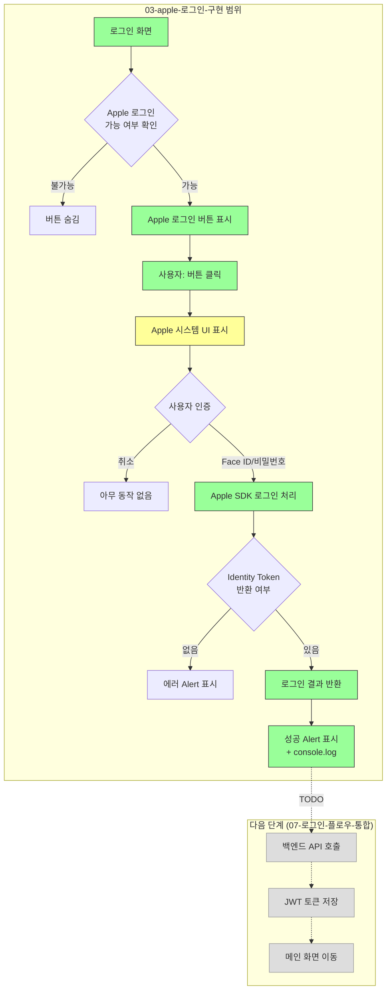

# 03. Apple 로그인 구현

## 목표

`expo-apple-authentication`을 사용하여 Apple 로그인 SDK를 연동합니다.

> **현재 범위**: SDK를 통해 Identity Token과 사용자 정보를 가져오는 것까지 구현합니다.
> 백엔드 API 연동은 API가 준비된 후 별도로 진행합니다.

## 상태

⬜ 대기

## 선행 조건

- [x] 01-eas-프로젝트-설정 완료
- [x] 02-apple-developer-설정 완료

## 유저 플로우



**범례:**
- 🟢 녹색: 이 태스크에서 구현
- 🟡 노란색: 네이티브 시스템 UI (Apple 제공)
- ⬜ 회색: 다음 태스크에서 구현 예정

## 폴더 구조

```
growit-mobile/src/
├── app/
│   ├── (auth)/
│   │   ├── _layout.tsx
│   │   └── Login.tsx          # 로그인 화면
│   └── _layout.tsx
├── components/
│   └── AppleLoginButton.tsx   # Apple 로그인 버튼
└── lib/
    └── auth/
        ├── AppleAuth.ts       # Apple 로그인 함수
        └── index.ts
```

## 작업 절차

### 1. 패키지 설치

```bash
cd growit-mobile
npx expo install expo-apple-authentication
```

### 2. Apple 로그인 함수 구현

#### src/lib/auth/AppleAuth.ts

```typescript
import * as AppleAuthentication from 'expo-apple-authentication';

/**
 * Apple 로그인 결과 타입
 */
export interface AppleLoginResult {
  identityToken: string;
  user: string;
  email: string | null;
  fullName: {
    givenName: string | null;
    familyName: string | null;
  } | null;
}

/**
 * Apple 로그인 가능 여부 확인
 */
export const isAppleLoginAvailable = (): Promise<boolean> => {
  return AppleAuthentication.isAvailableAsync();
};

/**
 * Apple 로그인 실행
 */
export const signInWithApple = async (): Promise<AppleLoginResult> => {
  const credential = await AppleAuthentication.signInAsync({
    requestedScopes: [
      AppleAuthentication.AppleAuthenticationScope.FULL_NAME,
      AppleAuthentication.AppleAuthenticationScope.EMAIL,
    ],
  });

  if (!credential.identityToken) {
    throw new Error('Apple 로그인 실패: Identity Token이 없습니다.');
  }

  return {
    identityToken: credential.identityToken,
    user: credential.user,
    email: credential.email,
    fullName: credential.fullName
      ? {
          givenName: credential.fullName.givenName,
          familyName: credential.fullName.familyName,
        }
      : null,
  };
};
```

### 3. 모듈 Export

#### src/lib/auth/index.ts

```typescript
export {
  isAppleLoginAvailable,
  signInWithApple,
  type AppleLoginResult,
} from './AppleAuth';
```

### 4. Apple 로그인 버튼 컴포넌트

#### src/components/AppleLoginButton.tsx

```typescript
import * as AppleAuthentication from 'expo-apple-authentication';
import { StyleSheet, View, Alert } from 'react-native';
import { isAppleLoginAvailable, signInWithApple } from '@/lib/auth';
import { useEffect, useState } from 'react';
import type { AppleLoginResult } from '@/lib/auth';

interface Props {
  onSuccess: (result: AppleLoginResult) => void;
  onError?: (error: Error) => void;
}

export const AppleLoginButton = ({ onSuccess, onError }: Props) => {
  const [isAvailable, setIsAvailable] = useState(false);

  useEffect(() => {
    isAppleLoginAvailable().then(setIsAvailable);
  }, []);

  const handleLogin = async () => {
    try {
      const result = await signInWithApple();

      // TODO: 백엔드 API 연동 후 토큰 전송
      console.log('Apple 로그인 성공:', {
        user: result.user,
        email: result.email,
        fullName: result.fullName,
        // identityToken은 길어서 일부만 출력
        identityToken: result.identityToken.substring(0, 50) + '...',
      });

      onSuccess(result);
    } catch (error) {
      if (error instanceof Error) {
        // 사용자가 취소한 경우
        if (error.message.includes('canceled')) {
          return;
        }
        onError?.(error);
        Alert.alert('로그인 실패', error.message);
      }
    }
  };

  if (!isAvailable) {
    return null;
  }

  return (
    <View style={styles.container}>
      <AppleAuthentication.AppleAuthenticationButton
        buttonType={AppleAuthentication.AppleAuthenticationButtonType.SIGN_IN}
        buttonStyle={AppleAuthentication.AppleAuthenticationButtonStyle.BLACK}
        cornerRadius={8}
        style={styles.button}
        onPress={handleLogin}
      />
    </View>
  );
};

const styles = StyleSheet.create({
  container: {
    width: '100%',
    alignItems: 'center',
  },
  button: {
    width: '100%',
    height: 50,
  },
});
```

### 5. 로그인 화면 구현

#### src/app/(auth)/Login.tsx

```typescript
import { View, Text, StyleSheet, Alert } from 'react-native';
import { AppleLoginButton } from '@/components/AppleLoginButton';
import type { AppleLoginResult } from '@/lib/auth';

export default function LoginScreen() {
  const handleLoginSuccess = (result: AppleLoginResult) => {
    // TODO: 백엔드 API 연동 후 처리
    console.log('로그인 성공!', result.user);

    // 임시: 성공 메시지만 표시
    Alert.alert(
      '로그인 성공',
      `환영합니다${result.fullName?.givenName ? `, ${result.fullName.givenName}님` : ''}!`
    );
  };

  return (
    <View style={styles.container}>
      <Text style={styles.title}>로그인</Text>
      <View style={styles.loginButtons}>
        <AppleLoginButton onSuccess={handleLoginSuccess} />
      </View>
    </View>
  );
}

const styles = StyleSheet.create({
  container: {
    flex: 1,
    justifyContent: 'center',
    alignItems: 'center',
    padding: 20,
  },
  title: {
    fontSize: 24,
    fontWeight: 'bold',
    marginBottom: 40,
  },
  loginButtons: {
    width: '100%',
    gap: 16,
  },
});
```

## Apple 로그인 결과 데이터

로그인 성공 시 받는 데이터:

```typescript
{
  identityToken: "eyJraWQiOiJXNldjT0...",  // JWT 토큰 (백엔드 전송용)
  user: "001234.abcd1234...",              // Apple User ID (고유 식별자)
  email: "user@privaterelay.appleid.com",  // 이메일 (첫 로그인만)
  fullName: {                               // 이름 (첫 로그인만)
    givenName: "길동",
    familyName: "홍"
  }
}
```

## 주의사항

### 최초 로그인 시에만 이름/이메일 제공

```
첫 번째 로그인:  email ✅, fullName ✅
두 번째 이후:    email ❌, fullName ❌
```

> **중요**: 백엔드 연동 시 첫 로그인 데이터를 반드시 저장해야 합니다.

### 테스트 시 초기화 방법

1. **설정** → **Apple ID** → **비밀번호 및 보안** → **Apple로 로그인한 앱**
2. 해당 앱 선택 → **Apple ID 사용 중단**

## 완료 조건

- [ ] expo-apple-authentication 설치
- [ ] AppleAuth.ts 구현
- [ ] AppleLoginButton.tsx 구현
- [ ] Login.tsx 화면 구현
- [ ] Development Build에서 테스트
- [ ] 로그인 성공 시 Identity Token 확인

## 다음 단계 (백엔드 API 준비 후)

- [ ] AuthApi.ts 구현 (백엔드 토큰 전송)
- [ ] TokenStorage.ts 구현 (JWT 저장)
- [ ] 로그인 성공 후 메인 화면 이동

## 참고 자료

- [expo-apple-authentication](https://docs.expo.dev/versions/latest/sdk/apple-authentication/)
- [Sign in with Apple - Human Interface Guidelines](https://developer.apple.com/design/human-interface-guidelines/sign-in-with-apple)
