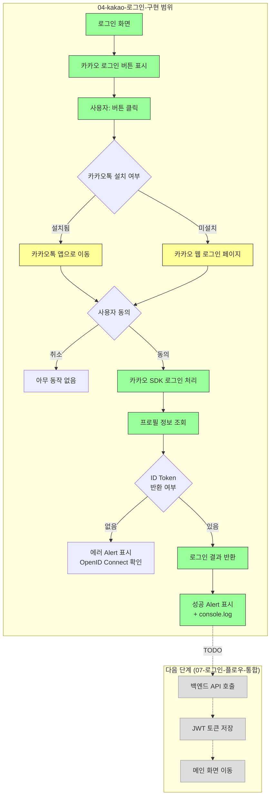

# 04. 카카오 로그인 구현

## 목표

`@react-native-seoul/kakao-login`을 사용하여 카카오 로그인 SDK를 연동합니다.

> **현재 범위**: SDK를 통해 ID Token과 사용자 정보를 가져오는 것까지 구현합니다.
> 백엔드 API 연동은 API가 준비된 후 07-로그인-플로우-통합에서 진행합니다.

## 상태

🔄 진행 중

## 선행 조건

- [x] 01-eas-프로젝트-설정 완료
- [ ] 카카오 개발자 설정 완료 (아래 참조)

## 유저 플로우



**범례:**
- 🟢 녹색: 이 태스크에서 구현
- 🟡 노란색: 카카오 시스템 UI (카카오톡/웹)
- ⬜ 회색: 다음 태스크에서 구현 예정

## 폴더 구조

```
growit-mobile/src/
├── app/
│   ├── (auth)/
│   │   ├── _layout.tsx
│   │   └── Login.tsx          # 로그인 화면
│   └── _layout.tsx
├── components/
│   └── KakaoLoginButton.tsx   # 카카오 로그인 버튼
└── lib/
    └── auth/
        ├── AppleAuth.ts       # Apple 로그인 (이전 태스크)
        ├── KakaoAuth.ts       # 카카오 로그인 함수
        └── index.ts
```

## 카카오 개발자 설정

### 1. 카카오 개발자 등록

1. [Kakao Developers](https://developers.kakao.com/) 접속
2. 로그인 후 **내 애플리케이션** → **애플리케이션 추가하기**
3. 앱 정보 입력:
   - 앱 이름: `GrowIt`
   - 회사명: (팀/회사명)

### 2. 플랫폼 등록

**내 애플리케이션** → **앱 설정** → **플랫폼**

#### iOS 플랫폼

| 항목 | 값 |
|------|-----|
| 번들 ID | `com.growitddd.growit-app` |

#### Android 플랫폼

| 항목 | 값 |
|------|-----|
| 패키지명 | `com.growitddd.growit_app` |
| 키 해시 | (아래 방법으로 생성) |

**키 해시 생성 방법:**

```bash
# 디버그 키 해시 (개발용)
keytool -exportcert -alias androiddebugkey -keystore ~/.android/debug.keystore -storepass android -keypass android | openssl sha1 -binary | openssl base64

# EAS Build 키 해시 확인
eas credentials
```

### 3. 카카오 로그인 활성화

**내 애플리케이션** → **제품 설정** → **카카오 로그인** → **일반**

#### 3-1. 사용 설정

| 항목 | 설정 값 | 설명 |
|------|--------|------|
| 사용 설정 상태 | **ON** | OFF시 KOE004 에러 발생 |

#### 3-2. OpenID Connect 활성화

| 항목 | 설정 값 | 설명 |
|------|--------|------|
| OpenID Connect | **ON** | ID Token(JWT) 발급에 필수 |

> ⚠️ **중요**: OpenID Connect가 OFF면 `idToken`이 `undefined`로 반환됩니다.

### 4. 동의 항목 설정

**내 애플리케이션** → **제품 설정** → **카카오 로그인** → **동의항목**

| 항목 | 동의 수준 | 용도 |
|------|----------|------|
| 닉네임 | 필수 | 사용자 이름 |
| 프로필 사진 | 선택 | 프로필 이미지 |
| 카카오계정(이메일) | 선택 (비즈 앱 필수 가능) | 이메일 |

> **참고**: 이메일을 필수로 받으려면 비즈 앱 전환이 필요합니다.

### 5. 앱 키 확인

**내 애플리케이션** → **앱 설정** → **앱 키**

필요한 키:
- **네이티브 앱 키**: iOS/Android 네이티브 SDK용
- **REST API 키**: 서버 API 호출용 (백엔드에서 사용)

## 작업 절차

### 1. 패키지 설치

```bash
cd growit-mobile
yarn add @react-native-seoul/kakao-login
```

### 2. 환경 변수 설정

카카오 앱 키를 GitHub에 노출하지 않기 위해 환경 변수를 사용합니다.

#### 2-1. .env 파일 생성

```bash
# growit-mobile/.env (gitignore에 추가됨)
KAKAO_NATIVE_APP_KEY=your_native_app_key_here
```

#### 2-2. .env.example 생성 (팀 공유용)

```bash
# growit-mobile/.env.example
KAKAO_NATIVE_APP_KEY=
```

#### 2-3. EAS 환경 변수 등록 (EAS Build 필수)

EAS Development Build에서는 `.env` 파일이 자동으로 읽히지 않습니다.
**반드시 EAS 환경 변수에 등록해야** 빌드된 앱이 정상 실행됩니다.

```bash
# 새 명령어 (권장)
eas env:create --name KAKAO_NATIVE_APP_KEY --value "your_native_app_key_here" --environment development

# 또는 기존 명령어 (deprecated)
eas secret:create --name KAKAO_NATIVE_APP_KEY --value "your_native_app_key_here" --scope project

# 등록 확인
eas env:list
# 또는
eas secret:list
```

> **참고**: `eas env:create` 실행 시 secret type 선택 → **string** 선택 (API 키는 단순 문자열)

> ⚠️ **중요**: EAS Secrets 미등록 시 앱 실행 즉시 크래시 발생
> (`RNKakaoLogins.init()` 에서 앱 키가 없어 초기화 실패)

등록 후 **반드시 새로 빌드**해야 합니다:

```bash
eas build --profile development --platform ios
# 또는
eas build --profile development --platform android
```

### 3. app.config.js 설정

`app.json`을 `app.config.js`로 변환하여 환경 변수를 사용합니다.

#### app.config.js

```javascript
export default {
  expo: {
    name: "growit-mobile",
    slug: "growit-mobile",
    // ... 기존 설정 유지
    plugins: [
      ["expo-router", { root: "./src/app" }],
      ["expo-splash-screen", { /* 기존 설정 */ }],
      [
        "@react-native-seoul/kakao-login",
        {
          kakaoAppKey: process.env.KAKAO_NATIVE_APP_KEY,
          kotlinVersion: "1.9.0"
        }
      ]
    ],
    ios: {
      bundleIdentifier: "com.growitddd.growit-app",
      supportsTablet: true,
      usesAppleSignIn: true,
      config: {
        usesNonExemptEncryption: false
      },
      infoPlist: {
        CFBundleURLTypes: [
          {
            CFBundleURLSchemes: [`kakao${process.env.KAKAO_NATIVE_APP_KEY}`]
          }
        ],
        LSApplicationQueriesSchemes: [
          "kakaokompassauth",
          "kakaolink",
          "kakaoplus"
        ]
      }
    },
    android: {
      package: "com.growitddd.growit_app",
      // ... 기존 설정 유지
    },
    // ... 나머지 설정
  }
};
```

> **참고**: `app.json`의 기존 설정을 모두 `app.config.js`로 옮기고, 카카오 관련 설정만 환경 변수로 처리합니다.

#### 보안 참고사항

| 항목 | 설명 |
|------|------|
| **노출 위험도** | 낮음~중간 (앱 키만으로는 API 호출 불가, 키 해시/번들 ID 검증 필요) |
| **권장 방식** | 환경 변수 사용으로 GitHub 노출 방지 |
| **EAS Build** | `eas secret`으로 빌드 시 자동 주입 |

### 3. 카카오 로그인 함수 구현

#### src/lib/auth/KakaoAuth.ts

```typescript
import {
  login,
  logout,
  getProfile,
  KakaoOAuthToken,
  KakaoProfile,
} from '@react-native-seoul/kakao-login';

/**
 * 카카오 로그인 결과 타입
 */
export interface KakaoLoginResult {
  idToken: string;
  accessToken: string;
  email: string | null;
  nickname: string | null;
  profileImageUrl: string | null;
}

/**
 * 카카오 로그인 실행
 */
export const signInWithKakao = async (): Promise<KakaoLoginResult> => {
  // 1. 카카오 로그인 (ID Token 포함)
  const token: KakaoOAuthToken = await login();

  if (!token.idToken) {
    throw new Error('카카오 로그인 실패: ID Token이 없습니다. OpenID Connect 활성화를 확인하세요.');
  }

  // 2. 프로필 정보 조회
  const profile: KakaoProfile = await getProfile();

  return {
    idToken: token.idToken,
    accessToken: token.accessToken,
    email: profile.email ?? null,
    nickname: profile.nickname ?? null,
    profileImageUrl: profile.profileImageUrl ?? null,
  };
};

/**
 * 카카오 로그아웃
 */
export const signOutFromKakao = async (): Promise<void> => {
  try {
    await logout();
  } catch (error) {
    // 이미 로그아웃된 상태일 수 있음
    console.warn('카카오 로그아웃:', error);
  }
};
```

### 4. 모듈 Export 업데이트

#### src/lib/auth/index.ts

```typescript
export {
  isAppleLoginAvailable,
  signInWithApple,
  type AppleLoginResult,
} from './AppleAuth';

export {
  signInWithKakao,
  signOutFromKakao,
  type KakaoLoginResult,
} from './KakaoAuth';
```

### 5. 카카오 로그인 버튼 컴포넌트

#### src/components/KakaoLoginButton.tsx

```typescript
import { TouchableOpacity, Text, StyleSheet, Alert, View } from 'react-native';
import { signInWithKakao } from '@/lib/auth';
import type { KakaoLoginResult } from '@/lib/auth';

interface Props {
  onSuccess: (result: KakaoLoginResult) => void;
  onError?: (error: Error) => void;
}

export const KakaoLoginButton = ({ onSuccess, onError }: Props) => {
  const handleLogin = async () => {
    try {
      const result = await signInWithKakao();

      // TODO: 백엔드 API 연동 후 토큰 전송
      console.log('카카오 로그인 성공:', {
        email: result.email,
        nickname: result.nickname,
        // idToken은 길어서 일부만 출력
        idToken: result.idToken.substring(0, 50) + '...',
      });

      onSuccess(result);
    } catch (error) {
      if (error instanceof Error) {
        // 사용자가 취소한 경우
        if (error.message.includes('cancelled') || error.message.includes('cancel')) {
          return;
        }
        onError?.(error);
        Alert.alert('로그인 실패', error.message);
      }
    }
  };

  return (
    <TouchableOpacity style={styles.button} onPress={handleLogin}>
      <View style={styles.content}>
        <Text style={styles.icon}>💬</Text>
        <Text style={styles.text}>카카오 로그인</Text>
      </View>
    </TouchableOpacity>
  );
};

const styles = StyleSheet.create({
  button: {
    width: '100%',
    height: 50,
    backgroundColor: '#FEE500',
    borderRadius: 8,
    justifyContent: 'center',
    alignItems: 'center',
  },
  content: {
    flexDirection: 'row',
    alignItems: 'center',
    gap: 8,
  },
  icon: {
    fontSize: 18,
  },
  text: {
    fontSize: 16,
    fontWeight: '600',
    color: '#000000',
  },
});
```

### 6. 로그인 화면 업데이트

#### src/app/(auth)/Login.tsx

```typescript
import { View, Text, StyleSheet, Alert } from 'react-native';
import { AppleLoginButton } from '@/components/AppleLoginButton';
import { KakaoLoginButton } from '@/components/KakaoLoginButton';
import type { AppleLoginResult, KakaoLoginResult } from '@/lib/auth';

export default function LoginScreen() {
  const handleAppleLoginSuccess = (result: AppleLoginResult) => {
    // TODO: 백엔드 API 연동 후 처리
    console.log('Apple 로그인 성공!', result.user);

    Alert.alert(
      '로그인 성공',
      `환영합니다${result.fullName?.givenName ? `, ${result.fullName.givenName}님` : ''}!`
    );
  };

  const handleKakaoLoginSuccess = (result: KakaoLoginResult) => {
    // TODO: 백엔드 API 연동 후 처리
    console.log('카카오 로그인 성공!', result.nickname);

    Alert.alert(
      '로그인 성공',
      `환영합니다${result.nickname ? `, ${result.nickname}님` : ''}!`
    );
  };

  return (
    <View style={styles.container}>
      <Text style={styles.title}>로그인</Text>
      <View style={styles.loginButtons}>
        <AppleLoginButton onSuccess={handleAppleLoginSuccess} />
        <KakaoLoginButton onSuccess={handleKakaoLoginSuccess} />
      </View>
    </View>
  );
}

const styles = StyleSheet.create({
  container: {
    flex: 1,
    justifyContent: 'center',
    alignItems: 'center',
    padding: 20,
  },
  title: {
    fontSize: 24,
    fontWeight: 'bold',
    marginBottom: 40,
  },
  loginButtons: {
    width: '100%',
    gap: 16,
  },
});
```

## 카카오 로그인 결과 데이터

로그인 성공 시 받는 데이터:

```typescript
{
  idToken: "eyJraWQiOiJXNldjT0...",    // JWT 토큰 (백엔드 전송용)
  accessToken: "abc123xyz...",         // 카카오 API 호출용
  email: "user@example.com",           // 이메일 (동의 시)
  nickname: "홍길동",                   // 닉네임
  profileImageUrl: "https://..."       // 프로필 이미지 URL
}
```

## Apple vs Kakao 로그인 비교

| 항목 | Apple | Kakao |
|------|-------|-------|
| 패키지 | `expo-apple-authentication` | `@react-native-seoul/kakao-login` |
| 토큰 | identityToken (JWT) | idToken (JWT, OpenID Connect) |
| 이름 제공 | 최초 로그인 시에만 | 항상 제공 |
| 이메일 제공 | 최초 로그인 시에만 | 동의 시 항상 제공 |
| 필수 설정 | Apple Developer | Kakao Developers |

## 에러 처리

| 에러 | 원인 | 처리 |
|------|------|------|
| `ID Token이 없습니다` | OpenID Connect 미활성화 | 카카오 개발자 콘솔에서 활성화 |
| `cancelled` | 사용자가 취소 | 무시 |
| `KEYSTORE_NOT_FOUND` | 키 해시 미등록 | 플랫폼에 키 해시 추가 |
| `MISCONFIGURED` | 앱 키 또는 설정 오류 | 설정 확인 |

## 완료 조건

- [ ] 카카오 개발자 앱 등록
- [ ] 플랫폼 설정 (iOS, Android)
- [ ] OpenID Connect 활성화
- [x] @react-native-seoul/kakao-login 설치
- [x] 환경 변수 설정 (.env, .env.example)
- [x] app.config.js 플러그인 설정
- [x] KakaoAuth.ts 구현
- [x] KakaoLoginButton 컴포넌트 구현
- [x] 로그인 화면에 버튼 추가
- [ ] Development Build에서 테스트
- [ ] 로그인 성공 시 ID Token 확인

## 다음 단계 (백엔드 API 준비 후)

- [ ] 07-로그인-플로우-통합에서 AuthApi.ts 구현 (백엔드 토큰 전송)
- [ ] 토큰 저장 및 화면 이동 처리

## 참고 자료

- [@react-native-seoul/kakao-login](https://github.com/react-native-seoul/react-native-kakao-login)
- [Kakao Developers - 카카오 로그인](https://developers.kakao.com/docs/latest/ko/kakaologin/common)
- [Kakao OpenID Connect](https://developers.kakao.com/docs/latest/ko/kakaologin/rest-api#oidc)
