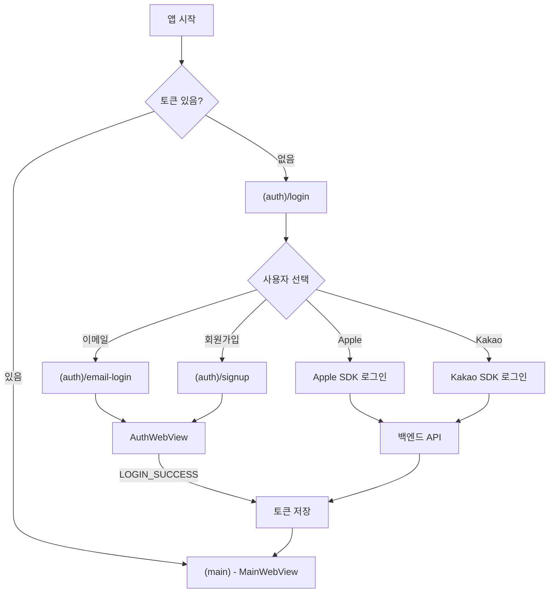

# 06.5. 이메일 인증 WebView

## 목표

이메일 로그인/회원가입 페이지를 WebView로 구현하고, 인증 성공 시 토큰을 앱으로 전달합니다.

## 상태

⬜ 대기

## 선행 조건

- [x] 06-webview-토큰-전달 완료

## 작업 개요

소셜 로그인 외에 이메일 로그인/회원가입 기능이 필요합니다. 이 화면들은 웹에서 구현되어 있으므로 WebView로 보여줍니다.

**핵심 차이점:**
- `MainWebView`: 토큰이 **있는** 상태에서 메인 서비스 표시
- `AuthWebView`: 토큰이 **없는** 상태에서 인증 플로우 진행 후 토큰 수신

## 컴포넌트 네이밍 변경

| 현재 이름 | 변경 후 | 용도 |
|----------|---------|------|
| `AuthenticatedWebView` | `MainWebView` | 로그인된 사용자용 (메인 서비스) |
| (신규) | `AuthWebView` | 인증 플로우용 (로그인/회원가입) |

## 메시지 프로토콜 확장

### 기존 메시지 타입 (변경 없음)

| 방향 | 타입 | 페이로드 | 설명 |
|------|------|----------|------|
| 웹 → 앱 | `READY` | - | 웹 로드 완료 |
| 앱 → 웹 | `AUTH_TOKEN` | `{ accessToken, refreshToken }` | 토큰 전달 |
| 웹 → 앱 | `TOKEN_REFRESHED` | `{ accessToken, refreshToken }` | 토큰 갱신됨 |
| 웹 → 앱 | `LOGOUT` | - | 로그아웃 요청 |

### 신규 메시지 타입

| 방향 | 타입 | 페이로드 | 설명 |
|------|------|----------|------|
| 웹 → 앱 | `LOGIN_SUCCESS` | `{ accessToken, refreshToken, user }` | 이메일 로그인/회원가입 성공 |

## 작업 절차

### 1. 메시지 타입 추가

#### src/lib/auth/webviewBridge.ts

```typescript
// 메시지 타입
export const MESSAGE_TYPES = {
  // 웹 → 앱 (기존)
  READY: 'READY',
  TOKEN_REFRESHED: 'TOKEN_REFRESHED',
  LOGOUT: 'LOGOUT',

  // 앱 → 웹 (기존)
  AUTH_TOKEN: 'AUTH_TOKEN',

  // 웹 → 앱 (신규)
  LOGIN_SUCCESS: 'LOGIN_SUCCESS',  // ⭐ 추가
} as const;

// ... 기존 코드 ...

// 신규 페이로드 타입
export interface LoginSuccessPayload {
  accessToken: string;
  refreshToken: string;
  user: {
    id: string;
    email: string;
    name: string;
    profileImage?: string;
  };
}
```

### 2. 컴포넌트 이름 변경

`AuthenticatedWebView.tsx` → `MainWebView.tsx`

```bash
# 파일 이름 변경
mv src/components/AuthenticatedWebView.tsx src/components/MainWebView.tsx
```

#### src/components/MainWebView.tsx

```typescript
import { useRef, useCallback } from 'react';
import { StyleSheet } from 'react-native';
import { WebView, WebViewMessageEvent } from 'react-native-webview';
import { useRouter } from 'expo-router';
import { useAuth, type Tokens } from '@/lib/auth/useAuth';
import {
  MESSAGE_TYPES,
  parseMessage,
  createMessage,
  type TokenPayload,
} from '@/lib/auth/webviewBridge';

interface Props {
  uri: string;
}

export const MainWebView = ({ uri }: Props) => {  // ⭐ 이름 변경
  const webViewRef = useRef<WebView>(null);
  const router = useRouter();
  const { tokens, login, logout, user } = useAuth();

  // 웹에 토큰 전달
  const sendTokensToWeb = useCallback(() => {
    if (!tokens) return;

    const message = createMessage<TokenPayload>(MESSAGE_TYPES.AUTH_TOKEN, {
      accessToken: tokens.accessToken,
      refreshToken: tokens.refreshToken,
    });

    webViewRef.current?.injectJavaScript(`
      window.dispatchEvent(new MessageEvent('message', {
        data: ${message}
      }));
      true;
    `);
  }, [tokens]);

  // 웹에서 메시지 수신
  const handleMessage = useCallback(
    async (event: WebViewMessageEvent) => {
      const message = parseMessage(event.nativeEvent.data);
      if (!message) return;

      switch (message.type) {
        case MESSAGE_TYPES.READY:
          sendTokensToWeb();
          break;

        case MESSAGE_TYPES.TOKEN_REFRESHED:
          const payload = message.payload as TokenPayload;
          if (payload?.accessToken && payload?.refreshToken) {
            const newTokens: Tokens = {
              accessToken: payload.accessToken,
              refreshToken: payload.refreshToken,
            };
            if (user) {
              await login(newTokens, user);
            }
          }
          break;

        case MESSAGE_TYPES.LOGOUT:
          await logout();
          router.replace('/(auth)/login');
          break;
      }
    },
    [sendTokensToWeb, login, logout, user, router]
  );

  return (
    <WebView
      ref={webViewRef}
      source={{ uri }}
      style={styles.webview}
      onMessage={handleMessage}
      javaScriptEnabled={true}
      domStorageEnabled={true}
      sharedCookiesEnabled={false}
      webviewDebuggingEnabled={__DEV__}
    />
  );
};

const styles = StyleSheet.create({
  webview: {
    flex: 1,
  },
});
```

### 3. AuthWebView 컴포넌트 구현

#### src/components/AuthWebView.tsx

```typescript
import { useRef, useCallback } from 'react';
import { StyleSheet } from 'react-native';
import { WebView, WebViewMessageEvent } from 'react-native-webview';
import { useRouter } from 'expo-router';
import { useAuth, type Tokens, type User } from '@/lib/auth/useAuth';
import {
  MESSAGE_TYPES,
  parseMessage,
  type LoginSuccessPayload,
} from '@/lib/auth/webviewBridge';

interface Props {
  uri: string;
}

export const AuthWebView = ({ uri }: Props) => {
  const webViewRef = useRef<WebView>(null);
  const router = useRouter();
  const { login } = useAuth();

  // 웹에서 메시지 수신
  const handleMessage = useCallback(
    async (event: WebViewMessageEvent) => {
      const message = parseMessage(event.nativeEvent.data);
      if (!message) return;

      switch (message.type) {
        case MESSAGE_TYPES.LOGIN_SUCCESS:
          const payload = message.payload as LoginSuccessPayload;
          if (payload?.accessToken && payload?.refreshToken && payload?.user) {
            const tokens: Tokens = {
              accessToken: payload.accessToken,
              refreshToken: payload.refreshToken,
            };
            const user: User = {
              id: payload.user.id,
              email: payload.user.email,
              name: payload.user.name,
              profileImage: payload.user.profileImage,
            };

            // 토큰 및 사용자 정보 저장
            await login(tokens, user);

            // 메인 화면으로 이동
            router.replace('/(main)');
          }
          break;
      }
    },
    [login, router]
  );

  return (
    <WebView
      ref={webViewRef}
      source={{ uri }}
      style={styles.webview}
      onMessage={handleMessage}
      javaScriptEnabled={true}
      domStorageEnabled={true}
      sharedCookiesEnabled={false}
      webviewDebuggingEnabled={__DEV__}
    />
  );
};

const styles = StyleSheet.create({
  webview: {
    flex: 1,
  },
});
```

### 4. (auth) 그룹에 이메일 인증 화면 추가

#### src/app/(auth)/email-login.tsx

```typescript
import { StyleSheet, SafeAreaView } from 'react-native';
import { AuthWebView } from '@/components/AuthWebView';
import { WEB_URL } from '@/constants';

export default function EmailLoginScreen() {
  return (
    <SafeAreaView style={styles.container}>
      <AuthWebView uri={`${WEB_URL}/login/email`} />
    </SafeAreaView>
  );
}

const styles = StyleSheet.create({
  container: {
    flex: 1,
    backgroundColor: '#fff',
  },
});
```

#### src/app/(auth)/signup.tsx

```typescript
import { StyleSheet, SafeAreaView } from 'react-native';
import { AuthWebView } from '@/components/AuthWebView';
import { WEB_URL } from '@/constants';

export default function SignupScreen() {
  return (
    <SafeAreaView style={styles.container}>
      <AuthWebView uri={`${WEB_URL}/signup`} />
    </SafeAreaView>
  );
}

const styles = StyleSheet.create({
  container: {
    flex: 1,
    backgroundColor: '#fff',
  },
});
```

### 5. 로그인 화면에 네비게이션 추가

#### src/app/(auth)/login.tsx

```typescript
import { View, Text, StyleSheet, TouchableOpacity } from 'react-native';
import { useRouter } from 'expo-router';
import { AppleLoginButton } from '@/components/AppleLoginButton';
import { KakaoLoginButton } from '@/components/KakaoLoginButton';
// ... 기존 import

export default function LoginScreen() {
  const router = useRouter();
  // ... 기존 코드

  return (
    <View style={styles.container}>
      <Text style={styles.title}>로그인</Text>

      <View style={styles.loginButtons}>
        <AppleLoginButton onSuccess={handleAppleLoginSuccess} />
        <KakaoLoginButton onSuccess={handleKakaoLoginSuccess} />

        {/* 구분선 */}
        <View style={styles.divider}>
          <View style={styles.dividerLine} />
          <Text style={styles.dividerText}>또는</Text>
          <View style={styles.dividerLine} />
        </View>

        {/* 이메일 로그인 버튼 */}
        <TouchableOpacity
          style={styles.emailButton}
          onPress={() => router.push('/(auth)/email-login')}
        >
          <Text style={styles.emailButtonText}>이메일로 로그인</Text>
        </TouchableOpacity>
      </View>

      {/* 회원가입 링크 */}
      <View style={styles.signupContainer}>
        <Text style={styles.signupText}>아직 계정이 없으신가요? </Text>
        <TouchableOpacity onPress={() => router.push('/(auth)/signup')}>
          <Text style={styles.signupLink}>회원가입</Text>
        </TouchableOpacity>
      </View>
    </View>
  );
}

const styles = StyleSheet.create({
  // ... 기존 스타일
  divider: {
    flexDirection: 'row',
    alignItems: 'center',
    marginVertical: 20,
  },
  dividerLine: {
    flex: 1,
    height: 1,
    backgroundColor: '#E5E5E5',
  },
  dividerText: {
    marginHorizontal: 16,
    color: '#999',
    fontSize: 14,
  },
  emailButton: {
    height: 50,
    borderRadius: 8,
    backgroundColor: '#F5F5F5',
    justifyContent: 'center',
    alignItems: 'center',
  },
  emailButtonText: {
    fontSize: 16,
    fontWeight: '600',
    color: '#333',
  },
  signupContainer: {
    flexDirection: 'row',
    justifyContent: 'center',
    marginTop: 24,
  },
  signupText: {
    color: '#666',
    fontSize: 14,
  },
  signupLink: {
    color: '#007AFF',
    fontSize: 14,
    fontWeight: '600',
  },
});
```

### 6. (auth) 레이아웃 업데이트

#### src/app/(auth)/_layout.tsx

```typescript
import { Stack } from 'expo-router';

export default function AuthLayout() {
  return (
    <Stack screenOptions={{ headerShown: false }}>
      <Stack.Screen name="login" />
      <Stack.Screen name="email-login" />
      <Stack.Screen name="signup" />
    </Stack>
  );
}
```

### 7. (main) 화면에서 MainWebView 사용

#### src/app/(main)/index.tsx

```typescript
import { StyleSheet, SafeAreaView } from 'react-native';
import { MainWebView } from '@/components/MainWebView';  // ⭐ 이름 변경
import { WEB_URL } from '@/constants';

export default function MainScreen() {
  return (
    <SafeAreaView style={styles.container}>
      <MainWebView uri={WEB_URL} />
    </SafeAreaView>
  );
}

const styles = StyleSheet.create({
  container: {
    flex: 1,
    backgroundColor: '#fff',
  },
});
```

## 웹 사이드 구현 (웹 팀 협업)

웹에서 이메일 로그인/회원가입 성공 시 앱으로 토큰 전달:

```typescript
// 웹 - 로그인 성공 시
import { isInApp, sendToApp } from '@/utils/appBridge';

const handleLoginSuccess = (response: AuthResponse) => {
  if (isInApp()) {
    // 앱으로 토큰 전달
    sendToApp('LOGIN_SUCCESS', {
      accessToken: response.accessToken,
      refreshToken: response.refreshToken,
      user: response.user,
    });
  } else {
    // 웹 환경에서는 기존 로직
    localStorage.setItem('accessToken', response.accessToken);
    router.push('/');
  }
};
```

## 전체 플로우



## 파일 구조

```
src/
├── app/
│   ├── _layout.tsx
│   ├── (auth)/
│   │   ├── _layout.tsx
│   │   ├── login.tsx          ← 이메일/회원가입 버튼 추가
│   │   ├── email-login.tsx    ⭐ 신규
│   │   └── signup.tsx         ⭐ 신규
│   └── (main)/
│       ├── _layout.tsx
│       └── index.tsx          ← MainWebView 사용
│
├── components/
│   ├── MainWebView.tsx        ⭐ AuthenticatedWebView → 이름 변경
│   ├── AuthWebView.tsx        ⭐ 신규
│   ├── AppleLoginButton.tsx
│   └── KakaoLoginButton.tsx
│
└── lib/auth/
    ├── webviewBridge.ts       ← LOGIN_SUCCESS 추가
    └── ...
```

## 완료 조건

- [ ] `webviewBridge.ts`에 `LOGIN_SUCCESS` 메시지 타입 추가
- [ ] `AuthenticatedWebView.tsx` → `MainWebView.tsx` 이름 변경
- [ ] `AuthWebView.tsx` 컴포넌트 구현
- [ ] `(main)/index.tsx`에서 `MainWebView` import 변경
- [ ] `(auth)/email-login.tsx` 화면 구현
- [ ] `(auth)/signup.tsx` 화면 구현
- [ ] `(auth)/login.tsx`에 이메일/회원가입 네비게이션 추가
- [ ] `(auth)/_layout.tsx` Stack 업데이트
- [ ] 웹 사이드 `LOGIN_SUCCESS` 메시지 구현 (웹 팀 협업)
- [ ] 이메일 로그인 → 토큰 수신 → 메인 이동 테스트
- [ ] 회원가입 → 토큰 수신 → 메인 이동 테스트

## 참고 자료

- [06-webview-토큰-전달.md](./06-webview-토큰-전달.md)
- [references/2025-02-21-webview-app-토큰-플로우.md](../../references/2025-02-21-webview-app-토큰-플로우.md)
