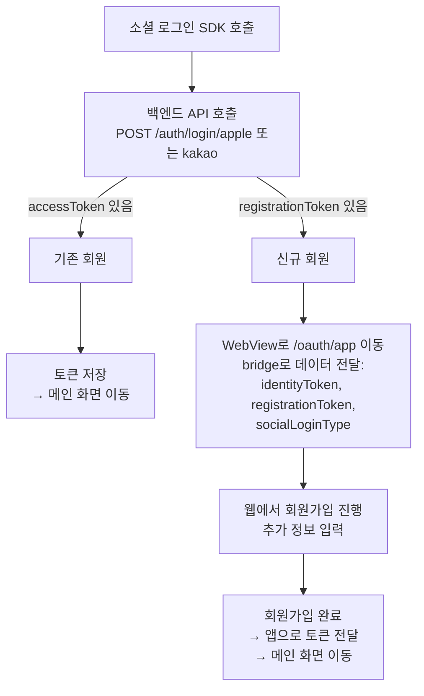
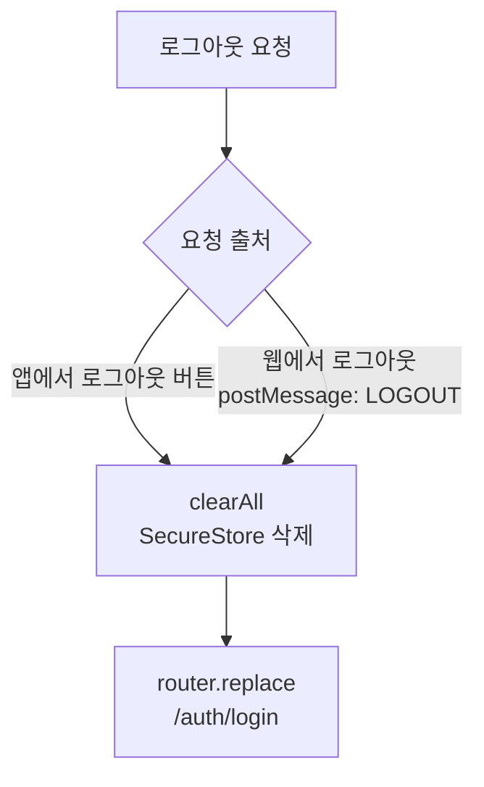
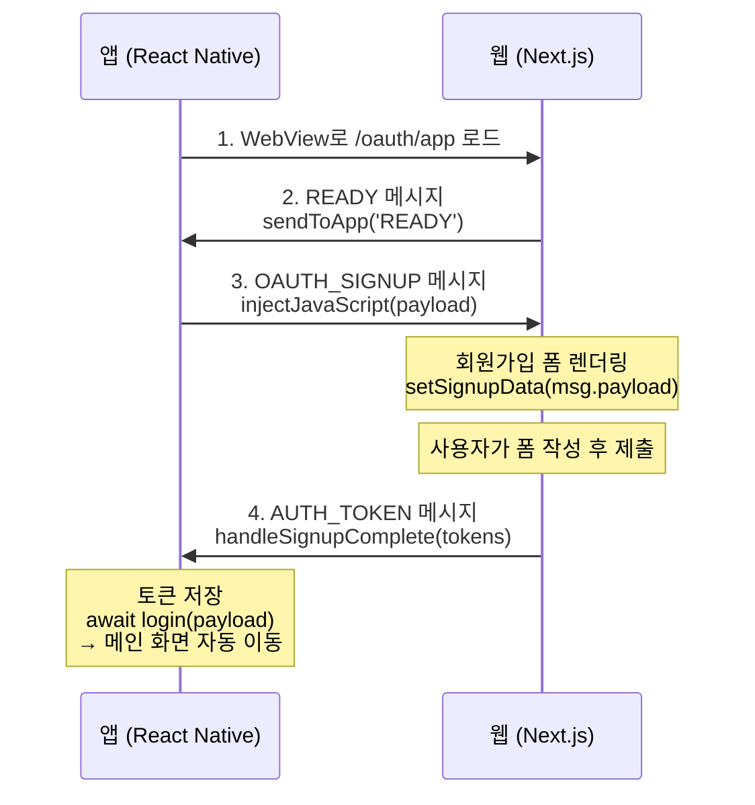
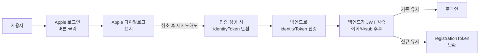

# 07. 로그인 플로우 통합

## 목표

백엔드 API 연동과 함께 로그인 상태에 따른 라우팅 및 전체 인증 플로우를 통합합니다.


## 상태

⬜ 대기

## 선행 조건

- [x] 03-apple-로그인-구현 완료
- [x] 04-kakao-로그인-구현 완료
- [x] 05-토큰-관리 완료
- [x] 06-webview-토큰-전달 완료
- [ ] **백엔드 소셜 로그인 API 준비**

## 작업 개요

이 태스크는 다음 작업을 포함합니다:

1. **백엔드 API 연동** - 소셜 로그인 토큰을 백엔드로 전송하여 JWT 발급
2. **라우팅 구현** - 인증 상태에 따른 화면 전환
3. **전체 플로우 통합** - SDK → API → 토큰 저장 → 화면 이동
4. **신규 회원 회원가입 플로우** - registrationToken 응답 시 WebView 회원가입 페이지로 이동

## 작업 절차

### 1. 백엔드 API 클라이언트 구현

#### 소셜 로그인 API 스펙

> **⚠️ 백엔드 확인 필요**: Kakao 로그인의 `authorizationCode` 값이 실제로 필요한지, 어떤 값을 전달해야 하는지 백엔드 팀과 확인 필요.
> Kakao SDK는 Apple과 달리 별도의 `authorizationCode`를 반환하지 않으므로, 현재는 `accessToken`을 `authorizationCode`로 매핑하고 있음.

##### POST /auth/signin/apple (Apple 로그인)

**Request:**
```json
{
  "idToken": "apple.identity.token.string",
  "authorizationCode": "apple.authorization.code.string"
}
```

**Response (기존 회원):**
```json
{
  "data": {
    "accessToken": "jwt.access.token",
    "refreshToken": "jwt.refresh.token"
  }
}
```

**Response (신규 회원):**
```json
{
  "data": {
    "registrationToken": "registration.token.for.signup"
  }
}
```

##### POST /auth/signin/kakao (Kakao 로그인)

**Request:**
```json
{
  "idToken": "kakao.id.token.string",
  "authorizationCode": "kakao.access.token.string"
}
```

> **Note**: Kakao SDK는 `authorizationCode`를 별도로 제공하지 않음. 현재 `accessToken`을 `authorizationCode`로 매핑 중.

**Response:** Apple과 동일

---

#### src/lib/auth/auth.ts

```typescript
import { API_URL } from '@/constants';

/**
 * 소셜 로그인 API 응답
 * - 기존 회원: accessToken, refreshToken 반환
 * - 신규 회원: registrationToken 반환
 */
export interface SocialLoginResponse {
  data: {
    accessToken?: string;
    refreshToken?: string;
    registrationToken?: string;
  };
}

/**
 * Apple 소셜 로그인 API 호출
 */
export async function appleLogin(
  idToken: string,
  authorizationCode: string
): Promise<SocialLoginResponse> {
  const res = await fetch(`${API_URL}/auth/signin/apple`, {
    method: 'POST',
    headers: { 'Content-Type': 'application/json' },
    body: JSON.stringify({ idToken, authorizationCode }),
  });

  if (!res.ok) {
    const error = await res.json().catch(() => ({}));
    throw new Error(error.message || 'Apple 로그인에 실패했습니다.');
  }

  return res.json();
}

/**
 * Kakao 소셜 로그인 API 호출
 */
export async function kakaoSocialLogin(
  idToken: string,
  authorizationCode: string
): Promise<SocialLoginResponse> {
  const res = await fetch(`${API_URL}/auth/signin/kakao`, {
    method: 'POST',
    headers: { 'Content-Type': 'application/json' },
    body: JSON.stringify({ idToken, authorizationCode }),
  });

  if (!res.ok) {
    const error = await res.json().catch(() => ({}));
    throw new Error(error.message || '카카오 로그인에 실패했습니다.');
  }

  return res.json();
}
```

> **Note:** 토큰 갱신은 WebView에서 앱으로 메시지를 전달하는 방식으로 처리됩니다.

### 2. 라우팅 구조

```
src/app/
├── _layout.tsx           ← 루트 레이아웃 (인증 체크)
├── (auth)/               ← 비로그인 사용자
│   ├── _layout.tsx
│   └── login.tsx         ← 로그인 화면
├── (main)/               ← 로그인 사용자
│   ├── _layout.tsx
│   └── index.tsx         ← WebView (메인)
└── +not-found.tsx
```

### 3. 루트 레이아웃 (인증 체크)

#### src/app/_layout.tsx

> **중요:** `useAuth`는 Context 기반으로 구현되어 있으므로 `AuthProvider`로 감싸야 합니다.
> 자세한 내용은 [07.1-로그인-버그-수정-및-UX-개선.md](./07.1-로그인-버그-수정-및-UX-개선.md)를 참조하세요.

```typescript
import { useEffect } from 'react';
import { Stack, useRouter, useSegments } from 'expo-router';
import { View, ActivityIndicator, StyleSheet } from 'react-native';
import { StatusBar } from 'expo-status-bar';
import { useAuth, AuthProvider } from '@/lib/auth/useAuth';

function RootLayoutNav() {
  const { isLoading, isAuthenticated } = useAuth();
  const router = useRouter();
  const segments = useSegments();

  useEffect(() => {
    if (isLoading) return;

    const inAuthGroup = segments[0] === '(auth)';
    const inMainGroup = segments[0] === '(main)';

    if (!isAuthenticated && !inAuthGroup) {
      // 로그인 안됨 + auth 그룹 아님 → 로그인 페이지로
      router.replace('/(auth)/login');
    } else if (isAuthenticated && !inMainGroup) {
      // 로그인 됨 + main 그룹 아님 → 메인으로
      router.replace('/(main)');
    }
  }, [isLoading, isAuthenticated, segments, router]);

  // 로딩 중
  if (isLoading) {
    return (
      <View style={styles.loading}>
        <ActivityIndicator size="large" color="#FFFFFF" />
      </View>
    );
  }

  return (
    <>
      <Stack
        screenOptions={{
          headerShown: false,
          contentStyle: { backgroundColor: '#0f0f10' },
        }}
      >
        <Stack.Screen name="(auth)" />
        <Stack.Screen name="(main)" />
      </Stack>
      <StatusBar style="light" />
    </>
  );
}

export default function RootLayout() {
  return (
    <AuthProvider>
      <RootLayoutNav />
    </AuthProvider>
  );
}

const styles = StyleSheet.create({
  loading: {
    flex: 1,
    justifyContent: 'center',
    alignItems: 'center',
    backgroundColor: '#0f0f10',
  },
});
```

### 4. Auth 그룹 레이아웃

#### src/app/(auth)/_layout.tsx

```typescript
import { Stack } from 'expo-router';

export default function AuthLayout() {
  return (
    <Stack screenOptions={{ headerShown: false }}>
      <Stack.Screen name="login" />
    </Stack>
  );
}
```

### 5. 로그인 화면 (BE API 연동)

#### src/app/(auth)/login.tsx

```typescript
import { View, Text, StyleSheet, SafeAreaView, Alert } from 'react-native';
import { useRouter } from 'expo-router';
import { AppleLoginButton } from '@/components/AppleLoginButton';
import { KakaoLoginButton } from '@/components/KakaoLoginButton';
import { useAuth } from '@/lib/useAuth';
import { socialLogin } from '@/lib/authApi';
import type { AppleLoginResult, KakaoLoginResult } from '@/lib/auth';

export default function LoginScreen() {
  const router = useRouter();
  const { login } = useAuth();

  const handleAppleLoginSuccess = async (appleResult: AppleLoginResult) => {
    try {
      // 1. 백엔드 API 호출
      const authResult = await socialLogin('apple', appleResult);

      // 2. 토큰 저장 (useAuth 통해)
      await login({
        accessToken: authResult.data.accessToken,
        refreshToken: authResult.data.refreshToken,
      });

      // 3. 메인 화면으로 이동
      router.replace('/(main)');
    } catch (error) {
      console.error('Apple 로그인 실패:', error);
      Alert.alert('로그인 실패', '다시 시도해주세요.');
    }
  };

  const handleKakaoLoginSuccess = async (kakaoResult: KakaoLoginResult) => {
    try {
      // 1. 백엔드 API 호출
      const authResult = await socialLogin('kakao', kakaoResult);

      // 2. 토큰 저장
      await login({
        accessToken: authResult.data.accessToken,
        refreshToken: authResult.data.refreshToken,
      });

      // 3. 메인 화면으로 이동
      router.replace('/(main)');
    } catch (error) {
      console.error('카카오 로그인 실패:', error);
      Alert.alert('로그인 실패', '다시 시도해주세요.');
    }
  };

  return (
    <SafeAreaView style={styles.container}>
      <View style={styles.content}>
        {/* 로고/타이틀 영역 */}
        <View style={styles.header}>
          <Text style={styles.title}>GrowIt</Text>
          <Text style={styles.subtitle}>성장을 위한 첫 걸음</Text>
        </View>

        {/* 로그인 버튼 영역 */}
        <View style={styles.loginButtons}>
          <AppleLoginButton onSuccess={handleAppleLoginSuccess} />
          <KakaoLoginButton onSuccess={handleKakaoLoginSuccess} />
        </View>
      </View>
    </SafeAreaView>
  );
}

const styles = StyleSheet.create({
  container: {
    flex: 1,
    backgroundColor: '#fff',
  },
  content: {
    flex: 1,
    justifyContent: 'space-between',
    padding: 24,
    paddingBottom: 48,
  },
  header: {
    flex: 1,
    justifyContent: 'center',
    alignItems: 'center',
  },
  title: {
    fontSize: 48,
    fontWeight: 'bold',
    color: '#1a1a1a',
  },
  subtitle: {
    fontSize: 18,
    color: '#666',
    marginTop: 8,
  },
  loginButtons: {
    width: '100%',
    gap: 12,
  },
});
```

### 6. Main 그룹 레이아웃

#### src/app/(main)/_layout.tsx

```typescript
import { Stack } from 'expo-router';

export default function MainLayout() {
  return (
    <Stack screenOptions={{ headerShown: false }}>
      <Stack.Screen name="index" />
    </Stack>
  );
}
```

### 7. 메인 화면 (WebView)

#### src/app/(main)/index.tsx

```typescript
import { StyleSheet, SafeAreaView, StatusBar } from 'react-native';
import { AuthenticatedWebView } from '@/components/AuthenticatedWebView';
import { WEB_URL } from '@/constants';

export default function MainScreen() {
  return (
    <SafeAreaView style={styles.container}>
      <StatusBar barStyle="dark-content" />
      <AuthenticatedWebView uri={WEB_URL} />
    </SafeAreaView>
  );
}

const styles = StyleSheet.create({
  container: {
    flex: 1,
    backgroundColor: '#fff',
  },
});
```

### 8. 상수 파일

#### src/constants/index.ts

```typescript
// 웹 서비스 URL
export const WEB_URL = __DEV__
  ? 'http://localhost:3000'  // 개발 환경
  : 'https://your-production-web.com';  // 프로덕션

// API URL
export const API_URL = __DEV__
  ? 'http://localhost:8080'
  : 'https://your-production-api.com';

// 소셜 로그인 Provider
export const AUTH_PROVIDERS = {
  APPLE: 'apple',
  KAKAO: 'kakao',
} as const;

export type AuthProvider = (typeof AUTH_PROVIDERS)[keyof typeof AUTH_PROVIDERS];
```

## 전체 인증 플로우

```mermaid
flowchart TD
    A[앱 시작] --> B[_layout.tsx: useAuth 호출<br/>SecureStore에서 토큰 확인<br/>isLoading: true]
    B --> C[토큰 확인 완료<br/>isLoading: false]
    C -->|토큰 없음| D[/auth/login]
    C -->|토큰 있음| H[/main]

    D --> E[1. SDK 로그인<br/>Apple/Kakao]
    E --> F[2. 백엔드 API 호출<br/>socialLogin]
    F --> G[3. JWT 토큰 저장<br/>SecureStore]
    G --> H

    H --> I[WebView 로드<br/>postMessage로 토큰 전달]
```

## 신규 회원 회원가입 플로우

백엔드 소셜 로그인 API 응답 시, `accessToken` 대신 `registrationToken`이 반환되면 신규 회원으로 판단합니다.
이 경우 WebView를 통해 `/oauth/app` 페이지로 이동하여 회원가입을 진행합니다.

### 응답 타입

```typescript
/**
 * 소셜 로그인 API 응답
 * - 기존 회원: accessToken, refreshToken 반환
 * - 신규 회원: registrationToken 반환
 */
export interface SocialLoginResponse {
  data: {
    // 기존 회원인 경우
    accessToken?: string;
    refreshToken?: string;
    // 신규 회원인 경우
    registrationToken?: string;
  };
}
```

### WebView 브릿지 페이로드

신규 회원인 경우 WebView로 전달할 데이터:

```typescript
export interface OAuthSignupPayload {
  identityToken: string;        // SDK에서 받은 토큰 (Apple: identityToken, Kakao: idToken)
  registrationToken: string;    // 백엔드에서 받은 회원가입용 토큰
  socialLoginType: 'apple' | 'kakao';
}

// 메시지 타입 추가
export const MESSAGE_TYPES = {
  // ... 기존 타입들
  OAUTH_SIGNUP: 'OAUTH_SIGNUP',  // 앱 → 웹: 소셜 회원가입 데이터 전달
} as const;
```

### 처리 플로우



### 로그인 화면 구현 (신규 회원 처리 포함)

```typescript
// src/app/(auth)/login.tsx
import { useRouter } from 'expo-router';
import { useAuth } from '@/lib/auth/useAuth';
import { appleLogin, kakaoSocialLogin } from '@/lib/auth';
import type { AppleLoginResult, KakaoLoginResult, OAuthSignupPayload } from '@/lib/auth';

export default function LoginScreen() {
  const router = useRouter();
  const { login, setOAuthSignupData } = useAuth();

  const handleAppleLoginSuccess = async (result: AppleLoginResult) => {
    try {
      const authResult = await appleLogin(result.identityToken);
      const { data } = authResult;

      if (data.accessToken && data.refreshToken) {
        // 기존 회원: 토큰 저장 후 메인으로 이동
        await login({
          accessToken: data.accessToken,
          refreshToken: data.refreshToken,
        });
        // AuthProvider가 자동으로 메인 화면으로 라우팅
      } else if (data.registrationToken) {
        // 신규 회원: WebView 회원가입 페이지로 이동
        const signupPayload: OAuthSignupPayload = {
          identityToken: result.identityToken,
          registrationToken: data.registrationToken,
          socialLoginType: 'apple',
        };
        setOAuthSignupData(signupPayload);
        router.push('/(auth)/oauth-signup');
      }
    } catch (error) {
      console.error('Apple 로그인 실패:', error);
      Alert.alert('로그인 실패', '다시 시도해주세요.');
    }
  };

  const handleKakaoLoginSuccess = async (result: KakaoLoginResult) => {
    try {
      const authResult = await kakaoSocialLogin(result.idToken);
      const { data } = authResult;

      if (data.accessToken && data.refreshToken) {
        // 기존 회원
        await login({
          accessToken: data.accessToken,
          refreshToken: data.refreshToken,
        });
      } else if (data.registrationToken) {
        // 신규 회원
        const signupPayload: OAuthSignupPayload = {
          identityToken: result.idToken,
          registrationToken: data.registrationToken,
          socialLoginType: 'kakao',
        };
        setOAuthSignupData(signupPayload);
        router.push('/(auth)/oauth-signup');
      }
    } catch (error) {
      console.error('카카오 로그인 실패:', error);
      Alert.alert('로그인 실패', '다시 시도해주세요.');
    }
  };

  // ... UI 렌더링
}
```

### OAuth 회원가입 WebView 화면

```typescript
// src/app/(auth)/oauth-signup.tsx
import { useEffect, useRef } from 'react';
import { StyleSheet, SafeAreaView } from 'react-native';
import { WebView, WebViewMessageEvent } from 'react-native-webview';
import { useRouter } from 'expo-router';
import { useAuth } from '@/lib/auth/useAuth';
import { WEB_URL } from '@/constants';
import {
  MESSAGE_TYPES,
  parseMessage,
  createMessage,
} from '@/lib/auth/webviewBridge';

export default function OAuthSignupScreen() {
  const webViewRef = useRef<WebView>(null);
  const router = useRouter();
  const { oauthSignupData, login, clearOAuthSignupData } = useAuth();

  // WebView 로드 완료 시 회원가입 데이터 전달
  const handleWebViewLoad = () => {
    if (!oauthSignupData) return;

    const message = createMessage(MESSAGE_TYPES.OAUTH_SIGNUP, oauthSignupData);
    webViewRef.current?.injectJavaScript(`
      window.dispatchEvent(new MessageEvent('message', {
        data: ${message}
      }));
      true;
    `);
  };

  // 웹에서 회원가입 완료 메시지 수신
  const handleMessage = async (event: WebViewMessageEvent) => {
    const message = parseMessage(event.nativeEvent.data);
    if (!message) return;

    switch (message.type) {
      case MESSAGE_TYPES.READY:
        handleWebViewLoad();
        break;

      case MESSAGE_TYPES.AUTH_TOKEN:
        // 회원가입 완료 후 토큰 수신
        const payload = message.payload as { accessToken: string; refreshToken: string };
        if (payload?.accessToken && payload?.refreshToken) {
          await login({
            accessToken: payload.accessToken,
            refreshToken: payload.refreshToken,
          });
          clearOAuthSignupData();
          // AuthProvider가 자동으로 메인으로 라우팅
        }
        break;

      case MESSAGE_TYPES.CANCEL:
        // 회원가입 취소
        clearOAuthSignupData();
        router.back();
        break;
    }
  };

  useEffect(() => {
    // 회원가입 데이터 없이 접근 시 로그인 화면으로 리다이렉트
    if (!oauthSignupData) {
      router.replace('/(auth)/login');
    }
  }, [oauthSignupData, router]);

  if (!oauthSignupData) return null;

  return (
    <SafeAreaView style={styles.container}>
      <WebView
        ref={webViewRef}
        source={{ uri: `${WEB_URL}/oauth/app` }}
        style={styles.webview}
        onMessage={handleMessage}
        javaScriptEnabled={true}
        domStorageEnabled={true}
        webviewDebuggingEnabled={__DEV__}
      />
    </SafeAreaView>
  );
}

const styles = StyleSheet.create({
  container: {
    flex: 1,
    backgroundColor: '#1A1A1A',
  },
  webview: {
    flex: 1,
  },
});
```

### 웹 사이드 구현 (/oauth/app)

```typescript
// 웹 프로젝트: pages/oauth/app.tsx (또는 app/oauth/app/page.tsx)
import { useEffect, useState } from 'react';
import { onAppMessage, sendToApp, isInApp } from '@/utils/appBridge';

interface OAuthSignupData {
  identityToken: string;
  registrationToken: string;
  socialLoginType: 'apple' | 'kakao';
}

export default function OAuthAppSignup() {
  const [signupData, setSignupData] = useState<OAuthSignupData | null>(null);

  useEffect(() => {
    if (!isInApp()) {
      // 앱 환경이 아니면 일반 웹 회원가입으로 리다이렉트
      window.location.href = '/signup';
      return;
    }

    // 앱에 준비 완료 알림
    sendToApp('READY');

    // 앱에서 회원가입 데이터 수신
    const unsubscribe = onAppMessage((message) => {
      if (message.type === 'OAUTH_SIGNUP' && message.payload) {
        setSignupData(message.payload as OAuthSignupData);
      }
    });

    return unsubscribe;
  }, []);

  const handleSignupComplete = async (accessToken: string, refreshToken: string) => {
    // 앱에 토큰 전달
    sendToApp('AUTH_TOKEN', { accessToken, refreshToken });
  };

  const handleCancel = () => {
    sendToApp('CANCEL');
  };

  if (!signupData) {
    return <Loading />;
  }

  return (
    <SignupForm
      socialLoginType={signupData.socialLoginType}
      registrationToken={signupData.registrationToken}
      onComplete={handleSignupComplete}
      onCancel={handleCancel}
    />
  );
}
```

### 완료 조건

- [ ] `SocialLoginResponse` 타입에 `registrationToken` 추가
- [ ] `OAuthSignupPayload` 타입 정의
- [ ] `MESSAGE_TYPES`에 `OAUTH_SIGNUP`, `CANCEL` 추가
- [ ] `useAuth`에 `oauthSignupData`, `setOAuthSignupData`, `clearOAuthSignupData` 추가
- [ ] `login.tsx`에서 신규 회원 분기 처리
- [ ] `oauth-signup.tsx` 화면 구현
- [ ] 웹 `/oauth/app` 페이지 구현 (웹 팀 협업)
- [ ] 전체 플로우 테스트

## 로그아웃 플로우



## 파일 구조 최종

```
src/
├── app/
│   ├── _layout.tsx           ← 인증 체크 + AuthProvider
│   ├── (auth)/
│   │   ├── _layout.tsx
│   │   └── login.tsx
│   ├── (main)/
│   │   ├── _layout.tsx
│   │   └── index.tsx
│   └── +not-found.tsx
│
├── components/
│   ├── AppleLoginButton.tsx
│   ├── KakaoLoginButton.tsx
│   ├── AuthWebView.tsx       ← 인증용 WebView (이메일 로그인)
│   ├── MainWebView.tsx       ← 메인 콘텐츠 WebView
│   └── ...
│
├── lib/
│   ├── auth/
│   │   ├── AppleAuth.ts      ← Apple 로그인
│   │   ├── KakaoAuth.ts      ← 카카오 로그인
│   │   ├── index.ts
│   │   ├── webviewBridge.ts  ← postMessage
│   │   └── useAuth/
│   │       ├── index.ts          ← Public API (useAuth, AuthProvider export)
│   │       ├── AuthContext.tsx   ← Context 기반 인증 상태 관리
│   │       ├── tokenStorage.ts   ← SecureStore (내부 전용)
│   │       └── tokenUtils.ts     ← JWT 유틸 (내부 전용)
│
└── constants/
    └── index.ts
```

> **Note:** `tokenStorage`와 `tokenUtils`는 외부에서 직접 import 불가. `useAuth` hook을 통해서만 토큰 관리.

## 백엔드 API 스펙

### POST /auth/signup/apple (애플 회원가입)

**Request:**
```json
{
  "registrationToken": "apple_login_api_에서_받은_토큰",
  "name": "홍길동",
  "jobRoleId": "backend_developer_id",
  "careerYear": "JUNIOR",
  "requiredConsent": {
    "privacyPolicy": true,
    "termsOfService": true
  }
}
```

**Response:**

| status | 설명 |
|--------|------|
| 201 | 회원가입 성공 |
| 400 | 입력 정보 오류 |

---

### POST /users/myprofile/apple/revoke (애플 연동 해제)

**Headers:**
```
Authorization: Bearer {accessToken}
```

**Request:** (Body 없음)

**Response:**

| status | 설명 |
|--------|------|
| 200 | 애플 연동 해제 성공 |
| 401 | 인증 실패 |

## 완료 조건

- [ ] authApi.ts 구현
- [ ] 루트 레이아웃에 인증 체크 구현
- [ ] (auth) 그룹 라우팅 설정
- [ ] (main) 그룹 라우팅 설정
- [ ] 로그인 화면에서 BE API 연동
- [ ] 메인 화면에 WebView 연동
- [ ] 로그아웃 플로우 구현
- [ ] 전체 플로우 테스트

## 테스트 시나리오

| 시나리오 | 예상 동작 |
|----------|----------|
| 앱 최초 실행 (토큰 없음) | 로그인 화면 표시 |
| Apple 로그인 성공 | BE API 호출 → 토큰 저장 → 메인 화면 이동 |
| Kakao 로그인 성공 | BE API 호출 → 토큰 저장 → 메인 화면 이동 |
| 앱 재시작 (토큰 있음) | 바로 메인 화면 |
| 토큰 만료 | 로그인 화면으로 이동 |
| 웹에서 로그아웃 | 앱도 로그아웃, 로그인 화면 |
| BE API 오류 | 에러 Alert 표시 |

---

## 웹 팀 협업 가이드

### 개요

앱에서 소셜 로그인(Apple/Kakao) 후 신규 회원인 경우, WebView를 통해 웹의 `/oauth/app` 페이지로 이동하여 회원가입을 진행합니다.
앱과 웹 간의 통신은 `postMessage` 프로토콜을 사용합니다.

### 메시지 프로토콜

#### 메시지 타입

| 방향 | 타입 | 페이로드 | 설명 |
|------|------|----------|------|
| 웹 → 앱 | `READY` | - | 웹 페이지 로드 완료 |
| 앱 → 웹 | `OAUTH_SIGNUP` | `OAuthSignupPayload` | 소셜 회원가입 데이터 전달 |
| 웹 → 앱 | `AUTH_TOKEN` | `{ accessToken, refreshToken }` | 회원가입 완료 후 토큰 전달 |

#### 페이로드 타입

```typescript
// 앱에서 웹으로 전달하는 회원가입 데이터
interface OAuthSignupPayload {
  identityToken: string;        // SDK에서 받은 토큰 (Apple: identityToken, Kakao: idToken)
  registrationToken: string;    // 백엔드에서 받은 회원가입용 토큰
  socialLoginType: 'apple' | 'kakao';
}

// 웹에서 앱으로 전달하는 토큰 데이터
interface TokenPayload {
  accessToken: string;
  refreshToken: string;
}
```

### 웹 구현 체크리스트

#### 1. 앱 환경 감지 유틸리티

```typescript
// utils/appBridge.ts

// 앱 WebView 환경인지 확인
export const isInApp = (): boolean => {
  return typeof window !== 'undefined' &&
         window.ReactNativeWebView !== undefined;
};

// 앱으로 메시지 전송
export const sendToApp = (type: string, payload?: unknown): void => {
  if (!isInApp()) return;

  window.ReactNativeWebView.postMessage(
    JSON.stringify({ type, payload })
  );
};

// 앱에서 메시지 수신 리스너
export const onAppMessage = (
  callback: (message: { type: string; payload?: unknown }) => void
): (() => void) => {
  const handler = (event: MessageEvent) => {
    if (typeof event.data === 'object' && event.data.type) {
      callback(event.data);
    }
  };

  window.addEventListener('message', handler);
  return () => window.removeEventListener('message', handler);
};
```

#### 2. TypeScript 타입 선언

```typescript
// types/global.d.ts
interface Window {
  ReactNativeWebView?: {
    postMessage: (message: string) => void;
  };
}
```

#### 3. `/oauth/app` 페이지 구현

```typescript
// pages/oauth/app.tsx (또는 app/oauth/app/page.tsx)
import { useEffect, useState } from 'react';
import { isInApp, sendToApp, onAppMessage } from '@/utils/appBridge';

interface OAuthSignupData {
  identityToken: string;
  registrationToken: string;
  socialLoginType: 'apple' | 'kakao';
}

export default function OAuthAppSignup() {
  const [signupData, setSignupData] = useState<OAuthSignupData | null>(null);

  useEffect(() => {
    // 1. 앱 환경이 아니면 일반 웹 회원가입으로 리다이렉트
    if (!isInApp()) {
      window.location.href = '/signup';
      return;
    }

    // 2. 앱에 준비 완료 알림
    sendToApp('READY');

    // 3. 앱에서 회원가입 데이터 수신
    const unsubscribe = onAppMessage((message) => {
      if (message.type === 'OAUTH_SIGNUP' && message.payload) {
        setSignupData(message.payload as OAuthSignupData);
      }
    });

    return unsubscribe;
  }, []);

  // 회원가입 완료 시 호출
  const handleSignupComplete = (accessToken: string, refreshToken: string) => {
    sendToApp('AUTH_TOKEN', { accessToken, refreshToken });
  };

  if (!signupData) {
    return <Loading />;
  }

  return (
    <SignupForm
      socialLoginType={signupData.socialLoginType}
      registrationToken={signupData.registrationToken}
      onComplete={handleSignupComplete}
    />
  );
}
```

### 통신 플로우



### 웹 팀 구현 항목

| 항목 | 설명 | 우선순위 |
|------|------|----------|
| `utils/appBridge.ts` | 앱 통신 유틸리티 함수 구현 | 필수 |
| `types/global.d.ts` | ReactNativeWebView 타입 선언 | 필수 |
| `/oauth/app` 페이지 | 앱 전용 소셜 회원가입 페이지 | 필수 |
| 회원가입 폼 | socialLoginType에 따른 UI 분기 | 필수 |
| 에러 핸들링 | 회원가입 실패 시 에러 UI 표시 | 권장 |
| 로딩 상태 | 데이터 수신 전 로딩 UI | 권장 |

### 주의사항

1. **앱 환경 감지**: `isInApp()` 함수로 앱 WebView 환경인지 확인 필수
2. **READY 메시지**: 페이지 로드 완료 시 반드시 `READY` 메시지를 앱으로 전송해야 앱이 데이터를 전달함
3. **메시지 형식**: 모든 메시지는 `{ type: string, payload?: unknown }` 형식의 JSON 문자열
4. **토큰 전달**: 회원가입 완료 후 백엔드에서 받은 `accessToken`, `refreshToken`을 앱으로 전달

---

## Apple 로그인 엣지케이스

### Apple이 사용자 정보를 한 번만 제공하는 문제

Apple은 보안 정책상 **최초 로그인 시에만** `fullName`과 `email`을 SDK를 통해 제공합니다.
사용자가 로그인 다이얼로그에서 취소 후 재시도하면, 이 정보를 더 이상 받을 수 없습니다.

#### 왜 문제가 되지 않는가?

현재 아키텍처에서는 이 제한이 문제가 되지 않습니다:

1. **`identityToken`은 항상 제공됨**: 사용자가 인증에 성공하면 매번 `identityToken`(JWT)을 받습니다
2. **JWT 페이로드에 이메일 포함**: Apple의 `identityToken` JWT를 디코딩하면 `email` 필드가 포함되어 있습니다
3. **백엔드에서 사용자 식별**: 백엔드는 `identityToken`의 `sub`(subject) 클레임으로 사용자를 고유하게 식별합니다

```typescript
// identityToken JWT 페이로드 예시
{
  "iss": "https://appleid.apple.com",
  "sub": "001234.abcd1234...",  // 사용자 고유 식별자
  "email": "user@example.com",   // 항상 포함됨
  "email_verified": "true",
  "exp": 1234567890,
  ...
}
```

#### 실제 플로우



따라서 앱에서는 SDK가 제공하는 `fullName`, `email`을 별도로 저장하거나 처리할 필요가 없습니다.
**`identityToken`만 백엔드로 전달하면 됩니다.**

---

## 참고 자료

- [Expo Router - Authentication](https://docs.expo.dev/router/reference/authentication/)
- [Expo Router - Groups](https://docs.expo.dev/router/layouts/)
