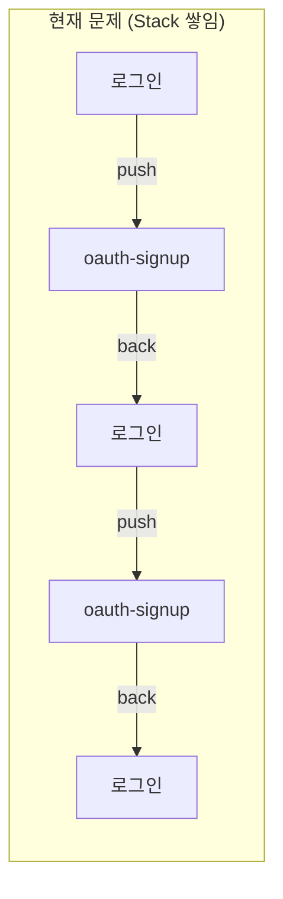
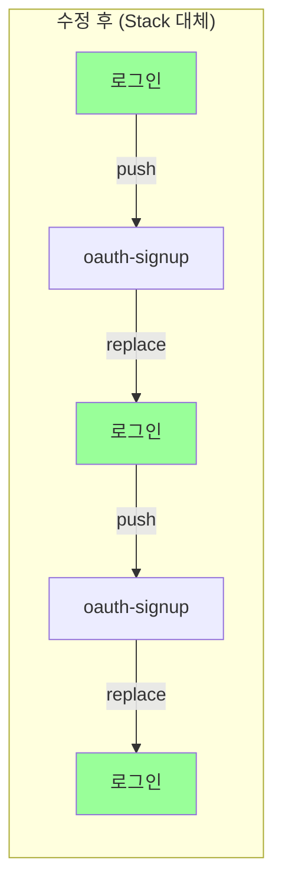

# 08. 사소한 버그 수정

## 목표

소셜 로그인 기능 구현 중 발견된 사소한 버그들을 수정합니다.

## 상태

⬜ 대기

## 선행 조건

- [x] 03-apple-로그인-구현 완료
- [x] 04-kakao-로그인-구현 완료
- [x] 06-webview-토큰-전달 완료
- [x] 07-로그인-플로우-통합 완료

---

## 버그 목록

### 1. NAVIGATE_TO_NATIVE_LOGIN 메시지 발행 시 스택이 쌓이는 문제

#### 문제 상황

WebView에서 `NAVIGATE_TO_NATIVE_LOGIN` 메시지를 발행하면 네이티브 로그인 화면으로 이동하는데, 이때 navigation stack에 화면이 계속 쌓이는 문제가 발생합니다.



사용자가 회원가입을 취소하고 다시 시도하면 스택이 계속 쌓여 뒤로가기 시 이전 화면들이 모두 나타나는 UX 문제가 발생합니다.

#### 원인 분석

두 곳에서 `router.push()` 또는 `router.back()`을 사용하여 스택이 쌓입니다:

**1. `login.tsx`에서 `oauth-signup`으로 이동할 때:**

```typescript
// src/app/(auth)/login.tsx:35, 64
router.push('/(auth)/oauth-signup');  // 문제: 스택에 oauth-signup이 쌓임
```

**2. `oauth-signup.tsx`에서 로그인 화면으로 돌아갈 때:**

```typescript
// src/app/(auth)/oauth-signup.tsx:50-54
case MESSAGE_TYPES.NAVIGATE_TO_NATIVE_LOGIN:
  // 회원가입 취소
  clearOAuthSignupData();
  router.back();  // 문제: 스택에서 이전 화면으로 돌아가지만, 히스토리 유지
  break;
```

반면 `AuthWebView.tsx`와 `MainWebView.tsx`에서는 올바르게 `router.replace()`를 사용하고 있습니다:

```typescript
// src/components/AuthWebView.tsx:41-43
case MESSAGE_TYPES.NAVIGATE_TO_NATIVE_LOGIN:
  router.replace('/(auth)/login');  // 올바름
  break;

// src/components/MainWebView.tsx:69-71
case MESSAGE_TYPES.NAVIGATE_TO_NATIVE_LOGIN:
  router.replace('/(auth)/login');  // 올바름
  break;
```

#### 해결 방안

인증 플로우 전체에서 `router.replace()`를 사용하여 스택이 쌓이지 않도록 합니다.

**1. `login.tsx` 수정:**

```typescript
// src/app/(auth)/login.tsx

// Before (문제)
router.push('/(auth)/oauth-signup');

// After (수정)
router.replace('/(auth)/oauth-signup');
```

**2. `oauth-signup.tsx` 수정:**

```typescript
// src/app/(auth)/oauth-signup.tsx

// Before (문제)
case MESSAGE_TYPES.NAVIGATE_TO_NATIVE_LOGIN:
  clearOAuthSignupData();
  router.back();
  break;

// After (수정)
case MESSAGE_TYPES.NAVIGATE_TO_NATIVE_LOGIN:
  clearOAuthSignupData();
  router.replace('/(auth)/login');
  break;
```

> 인증 플로우에서는 스택이 쌓일 필요가 없으므로 모든 화면 이동에 `replace`를 사용합니다.

#### 수정 이유

| 메서드 | 동작 | 사용 시점 |
|--------|------|----------|
| `router.back()` | 스택에서 이전 화면으로 이동, 현재 화면은 스택에서 제거 | 스택 히스토리를 유지해야 할 때 |
| `router.replace()` | 현재 화면을 새 화면으로 대체, 스택 히스토리 변경 없음 | 로그인/인증 플로우처럼 스택 초기화가 필요할 때 |

인증 플로우에서는 스택이 쌓이면 안 되므로 `router.replace()`가 적합합니다.



---

## 완료 조건

- [ ] `login.tsx`에서 `router.push()`를 `router.replace()`로 변경 (2곳)
- [ ] `oauth-signup.tsx`에서 `router.back()`을 `router.replace('/(auth)/login')`로 변경
- [ ] 회원가입 취소 후 로그인 화면으로 정상 이동 확인
- [ ] 스택이 쌓이지 않는지 테스트 (여러 번 취소 후 뒤로가기 동작 확인)

## 테스트 시나리오

| 시나리오 | 기대 동작 |
|----------|----------|
| 회원가입 취소 1회 | 로그인 화면으로 이동, 뒤로가기 시 앱 종료 |
| 회원가입 취소 후 재시도 후 다시 취소 | 로그인 화면으로 이동, 뒤로가기 시 앱 종료 (스택 쌓이지 않음) |
| 회원가입 완료 후 메인 이동 | 정상 작동 (기존 로직 유지) |

---

## 수정 파일

| 파일 | 수정 내용 |
|------|----------|
| `src/app/(auth)/login.tsx` | `router.push()` -> `router.replace()` (2곳) |
| `src/app/(auth)/oauth-signup.tsx` | `router.back()` -> `router.replace('/(auth)/login')` |

---

### 2. MainWebView 하단 Safe Area 배경색 변경

#### 문제 상황

MainWebView에서 하단 safe area의 배경색이 콘텐츠 배경색과 동일하여, 하단 탭바 영역과 구분이 되지 않는 문제가 있습니다.

#### 해결 방안

`react-native`의 `SafeAreaView`는 deprecated되었으므로, `react-native-safe-area-context`의 `useSafeAreaInsets` hook을 사용하여 상단/하단 safe area를 직접 제어합니다.

```typescript
// src/app/(main)/index.tsx

import { StyleSheet, View, StatusBar } from 'react-native';
import { useSafeAreaInsets } from 'react-native-safe-area-context';
import { MainWebView } from '@/components/MainWebView';
import { WEB_URL } from '@/constants';

export default function MainScreen() {
  const insets = useSafeAreaInsets();

  return (
    <View style={styles.container}>
      <StatusBar barStyle="light-content" />
      {/* 상단 safe area */}
      <View style={[styles.topSafeArea, { height: insets.top }]} />
      {/* WebView 콘텐츠 */}
      <MainWebView uri={`${WEB_URL}/home`} />
      {/* 하단 safe area */}
      <View style={[styles.bottomSafeArea, { height: insets.bottom }]} />
    </View>
  );
}

const styles = StyleSheet.create({
  container: {
    flex: 1,
    backgroundColor: '#0f0f10',
  },
  topSafeArea: {
    backgroundColor: '#0f0f10',
  },
  bottomSafeArea: {
    backgroundColor: '#1b1c1e',  // 하단 탭바 영역 배경색
  },
});
```

#### 수정 파일

| 파일 | 수정 내용 |
|------|----------|
| `src/app/(main)/index.tsx` | `useSafeAreaInsets` hook으로 상단/하단 safe area 분리, 하단 배경색 `#1b1c1e` 적용 |
