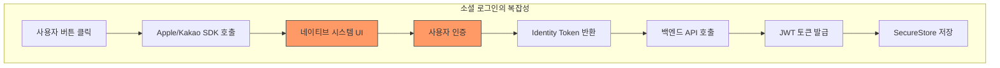
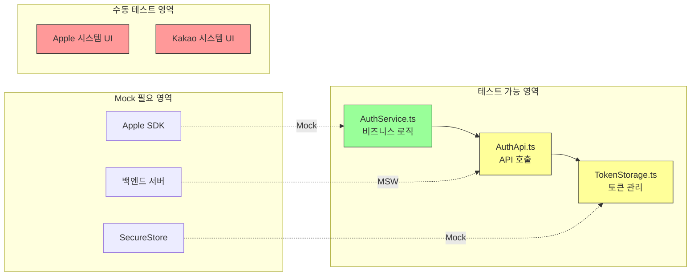

# 08. 테스트 구현

## 목표

소셜 로그인 기능에 대한 테스트 환경을 구성하고 테스트 코드를 작성합니다.

## 상태

⬜ 대기

## 선행 조건

- [ ] 03-apple-로그인-구현 완료
- [ ] 07-kakao-로그인-구현 완료

## 왜 테스트가 필요한가?

### 소셜 로그인 테스트의 어려움



**문제점:**
- 네이티브 SDK는 실제 기기에서만 동작
- Apple/Kakao 시스템 UI는 자동화 불가
- 외부 서비스 의존성으로 테스트 불안정
- 전체 플로우를 테스트하려면 수동 테스트 필요

### 테스트로 해결하고자 하는 문제

| 문제 | 해결 방법 | 테스트 유형 |
|------|----------|------------|
| SDK 없이 로직 검증 불가 | 의존성 주입으로 Mock 교체 | 통합 테스트 |
| API 에러 처리 검증 | MSW로 서버 응답 시뮬레이션 | API 테스트 |
| 버튼 상태 변화 검증 | Testing Library로 렌더링 테스트 | 컴포넌트 테스트 |
| 토큰 저장 검증 | SecureStore Mock | 통합 테스트 |

### 테스트 전략 다이어그램



## 테스트 범위

| 테스트 유형 | 대상 | 우선순위 |
|------------|------|----------|
| 통합 테스트 | `AuthService.ts` (로그인 로직) | 높음 |
| API 테스트 | `AuthApi.ts` (백엔드 통신) | 중간 |
| 컴포넌트 테스트 | `AppleLoginButton.tsx` | 중간 |
| E2E 테스트 | 실제 로그인 플로우 | 낮음 (수동) |

## 폴더 구조

```
growit-mobile/
├── __mocks__/                      # 전역 Mock 파일
│   ├── expo-apple-authentication.ts
│   └── expo-secure-store.ts
├── src/
│   └── lib/
│       └── auth/
│           └── __tests__/          # 테스트 파일
│               ├── AuthService.test.ts
│               ├── AuthApi.test.ts
│               └── Setup.ts        # 테스트 설정
├── jest.config.js                  # Jest 설정
└── jest.setup.js                   # Jest 전역 설정
```

## 작업 절차

### 1. 테스트 패키지 설치

```bash
cd growit-mobile

# Jest 및 Testing Library
yarn add -D jest @types/jest ts-jest

# React Native Testing Library
yarn add -D @testing-library/react-native @testing-library/jest-native

# MSW (API Mocking)
yarn add -D msw

# Jest Expo preset
yarn add -D jest-expo
```

### 2. Jest 설정

#### jest.config.js

```javascript
module.exports = {
  preset: 'jest-expo',
  setupFilesAfterEnv: ['./jest.setup.js'],
  transformIgnorePatterns: [
    'node_modules/(?!((jest-)?react-native|@react-native(-community)?)|expo(nent)?|@expo(nent)?/.*|@expo-google-fonts/.*|react-navigation|@react-navigation/.*|@unimodules/.*|unimodules|sentry-expo|native-base|react-native-svg)',
  ],
  moduleNameMapper: {
    '^@/(.*)$': '<rootDir>/src/$1',
  },
  collectCoverageFrom: [
    'src/**/*.{ts,tsx}',
    '!src/**/*.d.ts',
    '!src/**/index.ts',
  ],
  testMatch: ['**/__tests__/**/*.test.{ts,tsx}'],
};
```

#### jest.setup.js

```javascript
import '@testing-library/jest-native/extend-expect';

// 전역 Mock 설정
jest.mock('expo-apple-authentication');
jest.mock('expo-secure-store');
```

### 3. 전역 Mock 파일 생성

#### __mocks__/expo-apple-authentication.ts

```typescript
export const AppleAuthenticationScope = {
  FULL_NAME: 0,
  EMAIL: 1,
};

export const AppleAuthenticationButtonType = {
  SIGN_IN: 0,
  CONTINUE: 1,
};

export const AppleAuthenticationButtonStyle = {
  BLACK: 0,
  WHITE: 1,
  WHITE_OUTLINE: 2,
};

export const isAvailableAsync = jest.fn().mockResolvedValue(true);

export const signInAsync = jest.fn().mockResolvedValue({
  identityToken: 'mock-identity-token',
  user: 'mock-user-id-12345',
  email: 'test@privaterelay.appleid.com',
  fullName: {
    givenName: '길동',
    familyName: '홍',
    middleName: null,
    namePrefix: null,
    nameSuffix: null,
    nickname: null,
  },
  realUserStatus: 1,
  state: null,
  authorizationCode: 'mock-auth-code',
});

export const AppleAuthenticationButton = jest.fn(({ onPress, testID }) => {
  const { TouchableOpacity, Text } = require('react-native');
  return (
    <TouchableOpacity onPress={onPress} testID={testID}>
      <Text>Apple Login</Text>
    </TouchableOpacity>
  );
});
```

#### __mocks__/expo-secure-store.ts

```typescript
const store: Record<string, string> = {};

export const setItemAsync = jest.fn(
  async (key: string, value: string): Promise<void> => {
    store[key] = value;
  }
);

export const getItemAsync = jest.fn(
  async (key: string): Promise<string | null> => {
    return store[key] || null;
  }
);

export const deleteItemAsync = jest.fn(
  async (key: string): Promise<void> => {
    delete store[key];
  }
);

// 테스트 헬퍼: 스토어 초기화
export const __resetStore = () => {
  Object.keys(store).forEach((key) => delete store[key]);
};
```

### 4. 통합 테스트: AuthService.ts

#### src/lib/auth/__tests__/AuthService.test.ts

```typescript
import { createAuthService } from '../AuthService';
import type { AuthDependencies } from '../Types';

describe('AuthService', () => {
  // Mock 의존성
  const createMockDeps = (): AuthDependencies => ({
    appleSDK: {
      isAvailable: jest.fn(),
      signIn: jest.fn(),
    },
  });

  let mockDeps: ReturnType<typeof createMockDeps>;

  beforeEach(() => {
    mockDeps = createMockDeps();
    jest.clearAllMocks();
  });

  describe('isAppleAvailable', () => {
    it('Apple 로그인이 가능하면 true를 반환한다', async () => {
      mockDeps.appleSDK.isAvailable.mockResolvedValue(true);
      const service = createAuthService(mockDeps);

      const result = await service.isAppleAvailable();

      expect(result).toBe(true);
      expect(mockDeps.appleSDK.isAvailable).toHaveBeenCalledTimes(1);
    });

    it('Apple 로그인이 불가능하면 false를 반환한다', async () => {
      mockDeps.appleSDK.isAvailable.mockResolvedValue(false);
      const service = createAuthService(mockDeps);

      const result = await service.isAppleAvailable();

      expect(result).toBe(false);
    });
  });

  describe('signInWithApple', () => {
    const mockCredential = {
      identityToken: 'test-identity-token',
      user: 'user-12345',
      email: 'test@example.com',
      fullName: {
        givenName: '길동',
        familyName: '홍',
      },
    };

    beforeEach(() => {
      mockDeps.appleSDK.signIn.mockResolvedValue(mockCredential);
    });

    it('Apple 로그인 성공 시 결과를 반환한다', async () => {
      const service = createAuthService(mockDeps);

      const result = await service.signInWithApple();

      expect(result).toEqual({
        identityToken: 'test-identity-token',
        user: 'user-12345',
        email: 'test@example.com',
        fullName: {
          givenName: '길동',
          familyName: '홍',
        },
      });
    });

    it('identityToken이 없으면 에러를 던진다', async () => {
      mockDeps.appleSDK.signIn.mockResolvedValue({
        ...mockCredential,
        identityToken: null,
      });
      const service = createAuthService(mockDeps);

      await expect(service.signInWithApple()).rejects.toThrow(
        'Apple 로그인 실패: Identity Token이 없습니다.'
      );
    });

    it('fullName이 없으면 null로 처리한다', async () => {
      mockDeps.appleSDK.signIn.mockResolvedValue({
        ...mockCredential,
        fullName: null,
      });
      const service = createAuthService(mockDeps);

      const result = await service.signInWithApple();

      expect(result.fullName).toBeNull();
    });

    it('email이 없으면 null로 처리한다', async () => {
      mockDeps.appleSDK.signIn.mockResolvedValue({
        ...mockCredential,
        email: null,
      });
      const service = createAuthService(mockDeps);

      const result = await service.signInWithApple();

      expect(result.email).toBeNull();
    });
  });
});
```

### 5. API 테스트: AuthApi.ts (MSW)

#### src/lib/auth/__tests__/AuthApi.test.ts

```typescript
import { rest } from 'msw';
import { setupServer } from 'msw/node';
import { socialLogin } from '../AuthApi';
import type { AppleLoginResult } from '../Types';

const API_BASE_URL = 'https://your-api.com';

// MSW 서버 설정
const server = setupServer(
  rest.post(`${API_BASE_URL}/api/auth/social`, (req, res, ctx) => {
    return res(
      ctx.json({
        accessToken: 'mock-access-token',
        refreshToken: 'mock-refresh-token',
        user: {
          id: '1',
          email: 'test@example.com',
          name: '홍길동',
        },
        isNewUser: false,
      })
    );
  })
);

beforeAll(() => server.listen());
afterEach(() => server.resetHandlers());
afterAll(() => server.close());

describe('AuthApi', () => {
  const mockAppleResult: AppleLoginResult = {
    identityToken: 'test-identity-token',
    user: 'user-12345',
    email: 'test@example.com',
    fullName: {
      givenName: '길동',
      familyName: '홍',
    },
  };

  describe('socialLogin', () => {
    it('Apple 로그인 성공 시 토큰과 사용자 정보를 반환한다', async () => {
      const result = await socialLogin('apple', mockAppleResult);

      expect(result).toEqual({
        accessToken: 'mock-access-token',
        refreshToken: 'mock-refresh-token',
        user: {
          id: '1',
          email: 'test@example.com',
          name: '홍길동',
        },
        isNewUser: false,
      });
    });

    it('신규 사용자인 경우 isNewUser가 true이다', async () => {
      server.use(
        rest.post(`${API_BASE_URL}/api/auth/social`, (req, res, ctx) => {
          return res(
            ctx.json({
              accessToken: 'token',
              refreshToken: 'refresh',
              user: { id: '2', email: 'new@example.com', name: '신규' },
              isNewUser: true,
            })
          );
        })
      );

      const result = await socialLogin('apple', mockAppleResult);

      expect(result.isNewUser).toBe(true);
    });

    it('인증 실패 시 에러를 던진다', async () => {
      server.use(
        rest.post(`${API_BASE_URL}/api/auth/social`, (req, res, ctx) => {
          return res(
            ctx.status(401),
            ctx.json({ message: '유효하지 않은 토큰입니다.' })
          );
        })
      );

      await expect(socialLogin('apple', mockAppleResult)).rejects.toThrow(
        '유효하지 않은 토큰입니다.'
      );
    });

    it('서버 에러 시 기본 에러 메시지를 반환한다', async () => {
      server.use(
        rest.post(`${API_BASE_URL}/api/auth/social`, (req, res, ctx) => {
          return res(ctx.status(500), ctx.json({}));
        })
      );

      await expect(socialLogin('apple', mockAppleResult)).rejects.toThrow(
        '로그인 실패'
      );
    });

    it('네트워크 에러를 처리한다', async () => {
      server.use(
        rest.post(`${API_BASE_URL}/api/auth/social`, (req, res) => {
          return res.networkError('Failed to connect');
        })
      );

      await expect(socialLogin('apple', mockAppleResult)).rejects.toThrow();
    });
  });
});
```

### 6. 컴포넌트 테스트: AppleLoginButton.tsx

#### src/components/__tests__/AppleLoginButton.test.tsx

```typescript
import React from 'react';
import { render, fireEvent, waitFor } from '@testing-library/react-native';
import { AppleLoginButton } from '../AppleLoginButton';

// Mock 모듈
jest.mock('@/lib/auth', () => ({
  authService: {
    signInWithApple: jest.fn(),
    isAppleAvailable: jest.fn(),
  },
  socialLogin: jest.fn(),
}));

jest.mock('@/lib/auth/TokenStorage', () => ({
  saveTokens: jest.fn(),
}));

jest.mock('react-native', () => {
  const RN = jest.requireActual('react-native');
  RN.Alert.alert = jest.fn();
  return RN;
});

import { authService, socialLogin } from '@/lib/auth';
import { saveTokens } from '@/lib/auth/TokenStorage';
import { Alert } from 'react-native';

describe('AppleLoginButton', () => {
  const mockOnSuccess = jest.fn();
  const mockOnError = jest.fn();

  beforeEach(() => {
    jest.clearAllMocks();
    (authService.isAppleAvailable as jest.Mock).mockResolvedValue(true);
  });

  it('Apple 로그인이 가능하면 버튼을 렌더링한다', async () => {
    const { getByTestId } = render(
      <AppleLoginButton onSuccess={mockOnSuccess} />
    );

    await waitFor(() => {
      expect(getByTestId('apple-login-button')).toBeTruthy();
    });
  });

  it('Apple 로그인이 불가능하면 버튼을 숨긴다', async () => {
    (authService.isAppleAvailable as jest.Mock).mockResolvedValue(false);

    const { queryByTestId } = render(
      <AppleLoginButton onSuccess={mockOnSuccess} />
    );

    await waitFor(() => {
      expect(queryByTestId('apple-login-button')).toBeNull();
    });
  });

  it('로그인 성공 시 onSuccess를 호출한다', async () => {
    (authService.signInWithApple as jest.Mock).mockResolvedValue({
      identityToken: 'token',
      user: 'user',
      email: 'test@test.com',
      fullName: null,
    });
    (socialLogin as jest.Mock).mockResolvedValue({
      accessToken: 'access',
      refreshToken: 'refresh',
      user: { id: '1', email: 'test@test.com', name: '홍길동' },
      isNewUser: false,
    });
    (saveTokens as jest.Mock).mockResolvedValue(undefined);

    const { getByTestId } = render(
      <AppleLoginButton onSuccess={mockOnSuccess} />
    );

    await waitFor(() => {
      fireEvent.press(getByTestId('apple-login-button'));
    });

    await waitFor(() => {
      expect(mockOnSuccess).toHaveBeenCalledTimes(1);
      expect(saveTokens).toHaveBeenCalledWith({
        accessToken: 'access',
        refreshToken: 'refresh',
      });
    });
  });

  it('로그인 실패 시 onError를 호출하고 Alert를 표시한다', async () => {
    const error = new Error('로그인 실패');
    (authService.signInWithApple as jest.Mock).mockRejectedValue(error);

    const { getByTestId } = render(
      <AppleLoginButton onSuccess={mockOnSuccess} onError={mockOnError} />
    );

    await waitFor(() => {
      fireEvent.press(getByTestId('apple-login-button'));
    });

    await waitFor(() => {
      expect(mockOnError).toHaveBeenCalledWith(error);
      expect(Alert.alert).toHaveBeenCalledWith('로그인 실패', '로그인 실패');
    });
  });

  it('사용자가 취소한 경우 에러를 무시한다', async () => {
    const error = new Error('User canceled');
    (authService.signInWithApple as jest.Mock).mockRejectedValue(error);

    const { getByTestId } = render(
      <AppleLoginButton onSuccess={mockOnSuccess} onError={mockOnError} />
    );

    await waitFor(() => {
      fireEvent.press(getByTestId('apple-login-button'));
    });

    await waitFor(() => {
      expect(mockOnError).not.toHaveBeenCalled();
      expect(Alert.alert).not.toHaveBeenCalled();
    });
  });
});
```

### 7. package.json 스크립트 추가

```json
{
  "scripts": {
    "test": "jest",
    "test:watch": "jest --watch",
    "test:coverage": "jest --coverage",
    "test:ci": "jest --ci --coverage --reporters=default --reporters=jest-junit"
  }
}
```

## 테스트 실행

```bash
# 전체 테스트 실행
yarn test

# 특정 파일만 테스트
yarn test AuthService.test.ts

# Watch 모드 (파일 변경 시 자동 실행)
yarn test:watch

# 커버리지 리포트 생성
yarn test:coverage
```

## 커버리지 목표

| 파일 | 목표 커버리지 |
|------|-------------|
| `AuthService.ts` | 90%+ |
| `AuthApi.ts` | 80%+ |
| `AppleLoginButton.tsx` | 70%+ |

## 완료 조건

- [ ] 테스트 패키지 설치
- [ ] Jest 설정 완료
- [ ] 전역 Mock 파일 생성
- [ ] AuthService.test.ts 작성 및 통과
- [ ] AuthApi.test.ts 작성 및 통과 (MSW)
- [ ] AppleLoginButton.test.tsx 작성 및 통과
- [ ] 커버리지 목표 달성

## 참고 자료

- [Jest 공식 문서](https://jestjs.io/)
- [React Native Testing Library](https://callstack.github.io/react-native-testing-library/)
- [MSW - Mock Service Worker](https://mswjs.io/)
- [jest-expo](https://docs.expo.dev/develop/unit-testing/)
- [소셜 로그인 테스트 전략](../../references/2025-02-18-소셜-로그인-테스트-전략.md)
